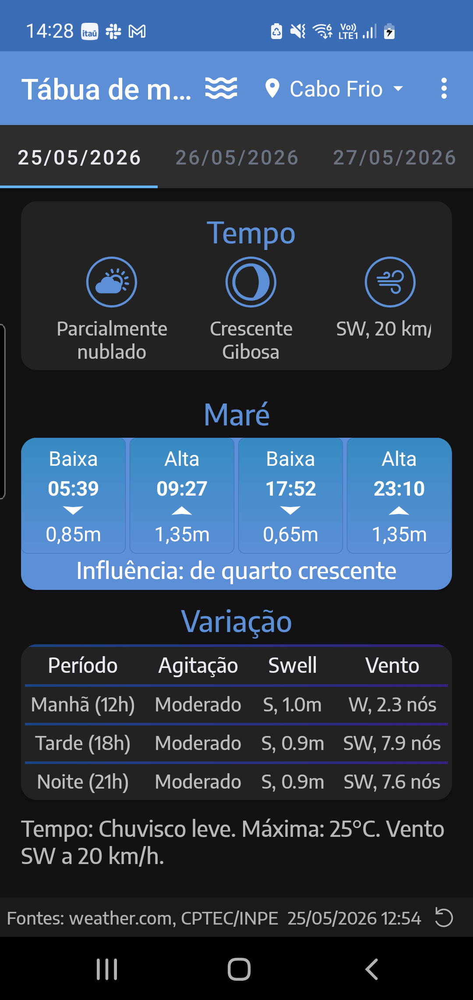
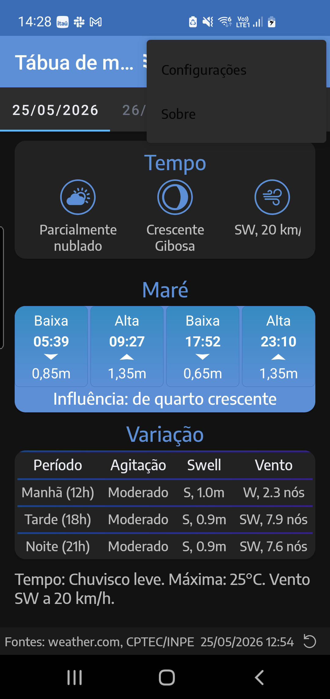
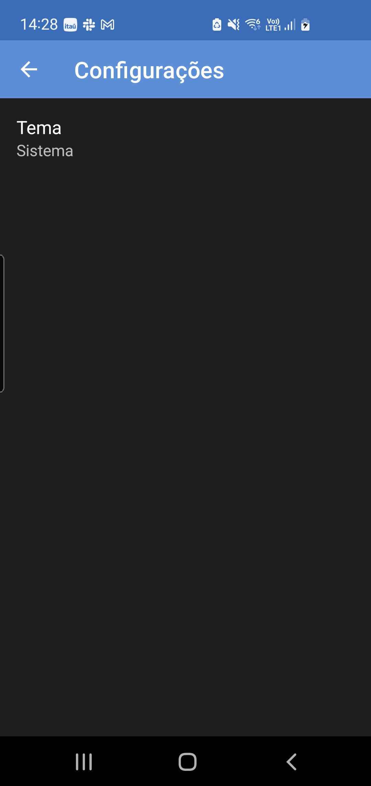
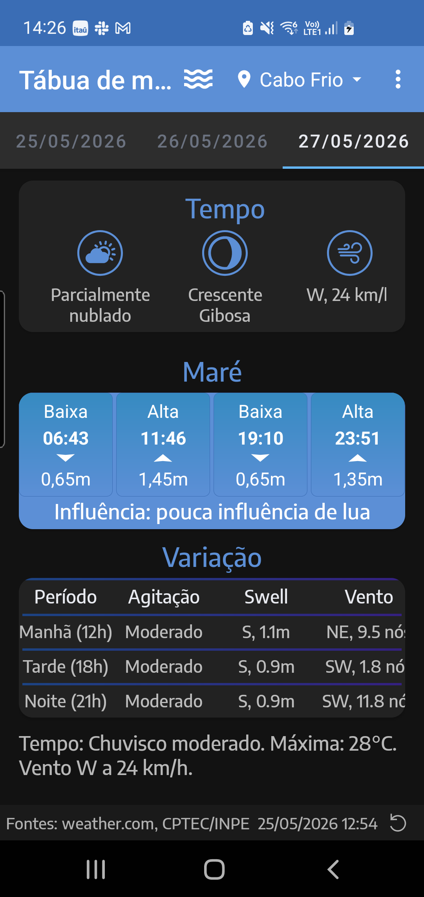

<div align="center">

# 🌊 Tábua de Marés

**Previsão de marés, tempo, fase da lua e condições do mar para o litoral brasileiro — em um único app, com funcionamento offline para a busca de cidades e dados que estão em cache.**



</div>

---

## 📖 Sobre

O **Tábua de Marés** é um aplicativo Android nativo voltado para quem vive ou pratica atividades no litoral — pescadores, mergulhadores, surfistas, velejadores e banhistas. Em uma única tela ele reúne, para a cidade escolhida e para os próximos dias:

- os horários e alturas das **marés** (preamares e baixa-mares);
- a **previsão do tempo** (condição, temperatura e vento);
- a **fase da lua** e sua influência sobre as marés;
- as **condições do mar** (agitação, swell e vento) por período do dia.

Os dados vêm de fontes públicas de meteorologia e tábuas de maré, consolidados em uma leitura rápida e direta.

## 📑 Índice

- [Funcionalidades](#-funcionalidades)
- [Galeria](#-galeria)
- [Fontes de dados](#-fontes-de-dados)
- [Tecnologias](#-tecnologias)
- [Como compilar e instalar](#-como-compilar-e-instalar)
- [Testes](#-testes)
- [Estrutura do projeto](#-estrutura-do-projeto)
- [Permissões](#-permissões)
- [Autor](#-autor)

---

## ✨ Funcionalidades

### 🏠 Painel consolidado de previsão

A tela inicial reúne tudo em cartões: **Tempo**, **Maré** e **Variação**, mais um resumo textual e a indicação das fontes com a data/hora da última atualização.


### 🌤️ Tempo

Mostra a **condição do tempo** (ensolarado, nublado, chuva, tempestade…), a **temperatura máxima e mínima** do dia e o **vento** (direção e velocidade). Um resumo em texto descreve o dia de forma natural, por exemplo: *"Chuvisco leve. Máxima: 25 °C. Vento SW a 20 km/h."*

### 🌊 Marés

Exibe as quatro principais **extremidades de maré** do dia — alternando entre **Baixa** e **Alta** — com **horário** e **altura em metros** de cada uma. Abaixo da tabela, uma linha indica a **influência da lua** sobre a maré daquele dia (ex.: *"Influência: de quarto crescente"*).

### 🌙 Fase da lua

A fase lunar atual é calculada e exibida junto ao cartão de Tempo, e é usada para estimar a influência sobre as marés. O cálculo é local (não depende de rede).

### 🛶 Condições do mar (Variação)

Uma tabela divide o dia em **Manhã, Tarde e Noite** e mostra, para cada período, a **agitação** do mar, a altura/período do **swell** e o **vento** — útil para escolher a melhor janela para entrar na água.

### 📅 Previsão para vários dias

As abas no topo permitem navegar entre **o dia atual e os próximos dias**. Toda a tela (tempo, marés e condições do mar) se atualiza para a data selecionada.

### 📍 Seleção de cidade

Toque no nome da cidade no topo para abrir a **busca**. O app traz um conjunto embarcado com **centenas de cidades litorâneas brasileiras**, então a busca funciona **mesmo sem internet**. A pesquisa é **tolerante a acentos** (digitar "florianopolis" encontra "Florianópolis").

- **Última cidade memorizada**: o app guarda a última cidade selecionada e a restaura automaticamente ao reabrir, em vez de voltar sempre para o padrão.
- **Sem recarga desnecessária**: selecionar a cidade que já está ativa não dispara um novo carregamento.

### 🎨 Tema claro, escuro ou do sistema

Em **Configurações** é possível escolher o tema do app: **Claro**, **Escuro** ou **Sistema** (acompanha o modo do Android). A interface foi harmonizada para os dois modos.

<div align="center">

&nbsp;&nbsp;

</div>

### 🔄 Atualização de dados

Há um **botão de atualizar** (com proteção contra toques repetidos) e o app também **revalida automaticamente** os dados quando estão com mais de algumas horas, mantendo a previsão sempre recente.

---

## 🖼️ Galeria

| Tela principal (claro) | Tela principal (escuro) | Menu | Configurações |
|:---:|:---:|:---:|:---:|
|  |  |  |  |

---

## 🔌 Fontes de dados

| Dado | Fonte |
|------|-------|
| Tempo (condição, temperatura, vento) | weather.com, CPTEC/INPE |
| Tábua de marés | tabuademares.com (via scraping) |
| Condições do mar (swell, agitação) | Open-Meteo Marine |
| Fase da lua | Cálculo local (Commons SunCalc) |
| Base de cidades litorâneas | Conjunto embarcado no app (offline) |

---

## 🛠️ Tecnologias

- **Linguagem**: Java 11
- **Build**: Gradle (wrapper incluído)
- **Plataforma**: Android — `minSdk 15`, `targetSdk 34`, `compileSdk 34`
- **Bibliotecas**:
  - [Volley](https://google.github.io/volley/) — cliente HTTP
  - [OrmLite](https://ormlite.com/) — ORM sobre SQLite
  - [Joda-Time](https://www.joda.org/joda-time/) — datas e horários
  - [JSoup](https://jsoup.org/) — parsing de HTML / scraping
  - [Commons SunCalc](https://shredzone.org/maven/commons-suncalc/) — cálculos solares/lunares

---

## 🚀 Como compilar e instalar

Pré-requisitos: JDK 11+ e o Android SDK (caminho configurado em `local.properties`). Use sempre o wrapper (`gradlew` / `gradlew.bat`).

```bash
# Compilar o APK de debug
./gradlew assembleDebug

# Instalar em um dispositivo/emulador conectado
./gradlew installDebug

# Gerar o APK de release
./gradlew assembleRelease

# Limpar artefatos de build
./gradlew clean
```

No Windows, use `gradlew.bat` no lugar de `./gradlew`.

---

## 🧪 Testes

O projeto usa **JUnit 4**, **Espresso** e **Mockito**.

```bash
# Testes unitários (JVM) — pasta src/test/
./gradlew test

# Rodar uma classe específica
./gradlew test --tests com.novoideal.tabuademares.service.CptecCityLookupServiceTest

# Testes instrumentados (requer dispositivo/emulador) — pasta src/androidTest/
./gradlew connectedAndroidTest
```

---

## 🗂️ Estrutura do projeto

O código segue um padrão **MVC** organizado em camadas:

```text
app/src/main/java/com/novoideal/tabuademares/
├── MainActivity.java        # Entrada do app; abas, seleção de cidade, atualização
├── controller/              # Lógica de negócio (Weather, Extremes, SeaCondition, Moon, Wind)
├── service/                 # Integrações com APIs e scraping
├── dao/                     # Acesso a dados (SQLite via OrmLite)
├── model/                   # Entidades de domínio
├── ui/                      # Fragments, diálogos e adapters
├── settings/                # Tela de Configurações (tema)
└── util/                    # Utilitários (carga de cidades, fila de requisições, temas)

app/src/main/assets/cidades_litoraneas.json   # Base offline de cidades litorâneas
```

> Fluxo de dados: **UI → Controller → Service (HTTP/scraping) → DAO (cache SQLite) → Controller → UI.**

---

## 🔐 Permissões

- `INTERNET`, `ACCESS_NETWORK_STATE`, `ACCESS_WIFI_STATE` — chamadas de API e estado da rede
- `READ_EXTERNAL_STORAGE` / `WRITE_EXTERNAL_STORAGE` — acesso a arquivos (legado)
- `READ_PHONE_STATE` — identificação do dispositivo

A configuração de segurança de rede fica em `app/src/main/res/xml/network_security_config.xml`.

---

## 👤 Autor

Desenvolvido por **Kann**.

Pacote: `com.novoideal.tabuademares` · Versão: `1.0`
