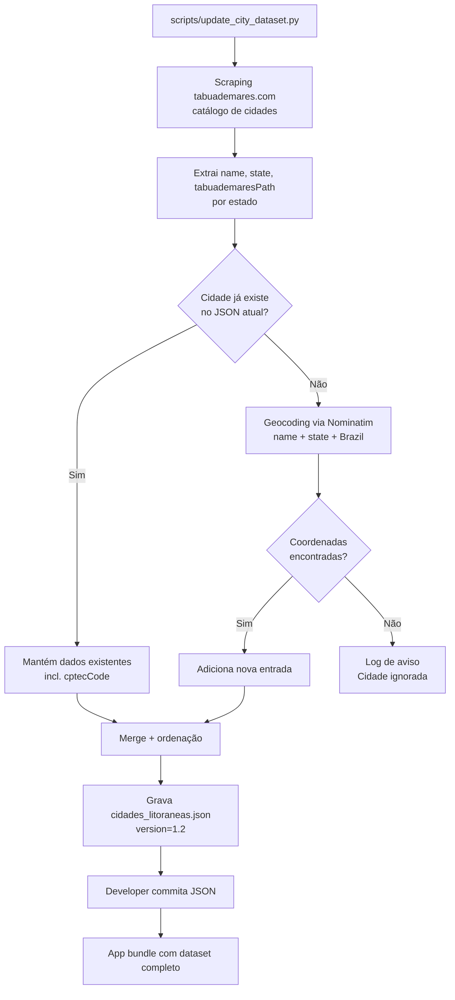

# Expand City Dataset

> **Status**: Done
> **Created**: 2026-05-25

## 1. Business Context

### Problem Statement

O arquivo `app/src/main/assets/cidades_litoraneas.json` contém apenas **83 cidades litorâneas brasileiras**. Muitas cidades costeiras relevantes estão ausentes — entre elas Cananéia (SP), Ilha Comprida (SP) e São José de Ribamar (MA). O site tabuademares.com, fonte dos dados de marés do app, cobre um conjunto de cidades significativamente maior. A divergência entre o dataset do app e o site significa que usuários dessas cidades não conseguem usar o app para nada além de clima e condições do mar (sem dados de maré).

A causa raiz é estrutural: o dataset foi construído manualmente e nunca foi sincronizado com o catálogo completo do tabuademares.com.

### Goals

- Expandir o dataset para cobrir todas as cidades disponíveis no tabuademares.com.
- Garantir que cada cidade nova tenha `tabuademaresPath` correto, permitindo scraping de marés.
- Fornecer coordenadas geográficas (`lat`/`lng`) precisas para cada cidade.
- Manter o schema JSON atual — zero breaking change no código do app.

### User Stories

#### US-1: Encontrar cidade litorânea no seletor

- **Story**: Como usuário, quero encontrar minha cidade litorânea no seletor do app, para que eu possa ver os dados de marés e clima relevantes para mim.
- **Acceptance Criteria**:
  - **Given** o app instalado, **when** o usuário abre o seletor de cidades e digita "Cananéia", **then** a cidade "Cananéia - SP" aparece na lista.
  - **Given** o app instalado, **when** o usuário abre o seletor de cidades e digita "São José de Ribamar", **then** "São José de Ribamar - MA" aparece na lista.
  - **Given** o app instalado, **when** o usuário abre o seletor de cidades e digita "Ilha Comprida", **then** "Ilha Comprida - SP" aparece na lista.
  - **Given** qualquer cidade disponível em tabuademares.com, **when** o usuário a seleciona, **then** os dados de marés são carregados via scraping (sem "sem dados" desnecessário).

#### US-2: Dados de maré corretos para cidades novas

- **Story**: Como usuário de uma cidade recém-adicionada, quero que os dados de maré apareçam corretamente, para que o app seja útil no meu litoral.
- **Acceptance Criteria**:
  - **Given** uma cidade nova com `tabuademaresPath` preenchido, **when** o usuário a seleciona, **then** `TabuadeMaresScraperService` faz scraping com o path correto e retorna os extremos de maré do dia.
  - **Given** uma cidade nova com `tabuademaresPath` vazio (não coberta pelo site), **when** o usuário a seleciona, **then** o app exibe a mensagem de "sem dados de maré" — comportamento idêntico ao atual para cidades sem path.

### Key Scenarios

| Cenário | Pré-condições | Passos | Resultado esperado |
|---|---|---|---|
| Cidade nova encontrada no seletor | JSON atualizado instalado | Digitar "Cananéia" no seletor | "Cananéia - SP" aparece na lista filtrada |
| Maré carregada para cidade nova | Cidade com `tabuademaresPath` correto selecionada | Aguardar carregamento | Extremos de maré exibidos (mesma lógica do fluxo atual) |
| Cidade sem path no tabuademares.com | Cidade adicionada sem path | Selecionar cidade | Mensagem de "sem dados de maré" — sem crash |
| Nenhuma regressão em cidade existente | JSON atualizado instalado | Selecionar "Cabo Frio" | Comportamento idêntico ao anterior |
| Busca com acento | JSON atualizado instalado | Digitar "Cananeia" (sem til) | "Cananéia - SP" aparece (FilterableCityAdapter já faz normalização) |

### Functional Requirements

- FR-1: O script de coleta deve descobrir todas as cidades com página de maré em tabuademares.com e extrair o `tabuademaresPath` de cada uma.
- FR-2: Para cada cidade descoberta, obter coordenadas geográficas (`lat`/`lng`) via Nominatim (OpenStreetMap), usando nome da cidade e estado como query.
- FR-3: O `cidades_litoraneas.json` gerado deve manter o schema existente: `name`, `state`, `lat`, `lng`, `cptecCode` (padrão `0`), `tabuademaresPath`.
- FR-4: Cidades já presentes no dataset devem ser **preservadas** com seus dados existentes — incluindo `cptecCode` já configurado (ex: Cabo Frio = 1059, Niterói = 3464).
- FR-5: O campo `version` do JSON deve ser incrementado (ex: `"1.1"` → `"1.2"`).
- FR-6: O script deve ser idempotente: executar duas vezes gera o mesmo resultado.

### Non-Functional Requirements

- NFR-1: O script é executado em **tempo de build/desenvolvimento** — não há scraping em runtime no app.
- NFR-2: O JSON gerado deve manter ordenação alfabética por `state` e depois por `name` para facilitar revisão de diff no git.
- NFR-3: Nenhuma alteração em código Java/Android — apenas o arquivo JSON e o script de geração.
- NFR-4: O script deve tratar erros de geocoding graciosamente (cidade não encontrada → log de aviso, cidade ignorada).

### Out of Scope

- Integração com CPTEC para obter `cptecCode` das novas cidades (campo permanece `0`).
- Atualização automática do dataset em runtime (dentro do app).
- Cobertura de cidades não litorâneas ou sem presença no tabuademares.com.
- Internacionalização ou suporte a países além do Brasil.
- Integração com WorldTides API para cidades sem `tabuademaresPath` — planejado para feature futura, com suporte a cadastro de API keys pelo usuário.

---

## 2. Arch Decisions

### Proposed Solution

Criar um script Python (`scripts/update_city_dataset.py`) que:

1. **Descobre cidades**: raspa o tabuademares.com para obter todas as páginas de maré disponíveis, extraindo o `tabuademaresPath` e nome/estado de cada cidade.
2. **Geocodifica**: para cada cidade nova (não presente no JSON atual), consulta a API Nominatim para obter `lat`/`lng`.
3. **Mescla**: combina as cidades existentes (preservando `cptecCode`) com as novas, deduplicando por `tabuademaresPath`.
4. **Serializa**: grava o JSON atualizado com ordenação e version bump.

O script é executado uma vez pelo desenvolvedor e o JSON resultante é commitado no repositório.

### Architecture Overview



### Alternatives Considered

| Alternativa | Prós | Contras | Veredicto |
|---|---|---|---|
| Curadoria manual do JSON | Simples, controle total | Inviável para muitas cidades; propenso a erro humano | Rejeitado |
| API de cidades do IBGE | Cobertura completa, oficial | Não tem `tabuademaresPath`; exigiria mapeamento manual de qualquer forma | Rejeitado |
| Sitemap.xml do tabuademares.com | Listagem estruturada, se existir | Pode não existir ou ser incompleto | Tentativa prioritária; fallback para scraping de páginas de estado |
| Scraping em runtime no app | Dataset sempre atualizado | Viola NFR-1; latência, consumo de dados, fragilidade | Rejeitado |
| Script Python build-time | Simples, independente do app, fácil de re-executar | Requer Python; dev precisa rodar manualmente | **Aceito** |

### Risks & Mitigations

| Risco | Impacto | Probabilidade | Mitigação |
|---|---|---|---|
| Estrutura HTML do tabuademares.com mudar | Alto | Médio | Script com seletores CSS explícitos; log de erros de parse para detecção rápida |
| Nominatim retornar coordenadas erradas (ex: Pará vs Paraná) | Médio | Médio | Query inclui estado (ex: `"Cananéia, SP, Brazil"`); validar que resultado está no Brasil (lat entre -35 e 6, lng entre -75 e -25) |
| Cidade no tabuademares.com mas não geocodificável | Baixo | Baixo | Log de aviso com lista de cidades não geocodificadas para revisão manual |
| Rate limiting do Nominatim | Baixo | Baixo | Delay de 1s entre chamadas conforme política de uso; User-Agent identificador |

### Key Decisions

#### Decision 1: Script Python build-time em vez de lógica no app

- **Status**: Aceito
- **Context**: A descoberta de cidades é um problema de pipeline de dados, não de comportamento em runtime. Adicionar lógica de scraping de catálogo dentro do app aumentaria complexidade, consumo de dados e tempo de inicialização.
- **Decision**: Script Python executado pelo desenvolvedor, output commitado como asset estático.
- **Consequences**: Dataset precisa de atualização manual periódica; ganho: zero impacto em runtime do app.

#### Decision 2: Geocoding via Nominatim (OpenStreetMap)

- **Status**: Aceito
- **Context**: Cada cidade precisa de `lat`/`lng` para que os controllers de clima e condições de mar funcionem. A alternativa seria Google Maps API (requer chave e tem custo).
- **Decision**: Usar `https://nominatim.openstreetmap.org/search` — gratuito, sem chave, cobertura nacional adequada.
- **Consequences**: Requer delay de 1s entre chamadas (política de uso do Nominatim); dataset do OSM pode ter lacunas para municípios pequenos.

#### Decision 3: Estratégia de descoberta — sitemap primeiro, scraping de estados como fallback

- **Status**: Aceito
- **Context**: Se `https://tabuademares.com/sitemap.xml` existir e listar todas as páginas de cidade, é a abordagem mais robusta. Caso contrário, o script percorre as páginas de cada estado.
- **Decision**: Tentar sitemap; se ausente ou incompleto, iterar por estados conhecidos (`/br/sao-paulo`, `/br/rio-de-janeiro`, etc.) e extrair links de cidade.
- **Consequences**: Script mais resiliente; em caso de mudança de estrutura, apenas o fallback precisa ser ajustado.

### Implementation Plan

1. Criar `scripts/update_city_dataset.py` com as etapas: descoberta → geocoding → merge → serialização.
2. Executar o script para gerar o novo `cidades_litoraneas.json`.
3. Verificar que as cidades citadas pelo usuário (Cananéia, Ilha Comprida, São José de Ribamar) estão presentes e com path correto.
4. Verificar que cidades existentes com `cptecCode > 0` mantiveram seus dados.
5. Verificar que o total de cidades aumentou substancialmente.
6. Commitar JSON e script.

---

## 3. Technical Contract

### Data Models

Schema do `cidades_litoraneas.json` — **inalterado**:

```json
{
  "version": "1.2",
  "cities": [
    {
      "name": "Cananéia",
      "state": "SP",
      "lat": -25.015,
      "lng": -47.926,
      "cptecCode": 0,
      "tabuademaresPath": "/br/sao-paulo/cananeia"
    }
  ]
}
```

| Campo | Tipo | Regra |
|---|---|---|
| `name` | String | Nome da cidade sem UF (ex: `"Cananéia"`) |
| `state` | String | Sigla UF com 2 caracteres (ex: `"SP"`) |
| `lat` | Double | Latitude decimal; Brasil: -35 a 6 |
| `lng` | Double | Longitude decimal; Brasil: -75 a -25 |
| `cptecCode` | Int | 0 para cidades novas; preservado para existentes |
| `tabuademaresPath` | String | Path relativo no tabuademares.com (ex: `"/br/sao-paulo/cananeia"`) ou `""` se não disponível |

### Interfaces

**`scripts/update_city_dataset.py`** — script standalone Python 3:

```
usage: python update_city_dataset.py [--dry-run]

Opções:
  --dry-run   Exibe contagem e lista de novas cidades sem gravar o JSON

Saída:
  - Grava app/src/main/assets/cidades_litoraneas.json
  - Imprime resumo: N cidades existentes preservadas, M novas adicionadas, K sem geocoding
```

**Funções internas principais:**

```python
def discover_cities() -> list[dict]:
    """Retorna lista de {'name', 'state', 'tabuademaresPath'} do tabuademares.com"""

def geocode(name: str, state: str) -> tuple[float, float] | None:
    """Consulta Nominatim; retorna (lat, lng) ou None se não encontrado"""

def merge(existing: list[dict], discovered: list[dict]) -> list[dict]:
    """Mescla cidades; chave de deduplicação: tabuademaresPath.
       Cidades existentes sem tabuademaresPath são mantidas pelo nome."""
```

### Integration Points

| Componente | Impacto |
|---|---|
| `app/src/main/assets/cidades_litoraneas.json` | Arquivo substituído com dataset expandido |
| `CityDatasetLoader.java` | Nenhuma alteração — lê o mesmo schema |
| `TabuadeMaresScraperService.java` | Nenhuma alteração — usa `tabuademaresPath` existente |
| `FilterableCityAdapter.java` | Nenhuma alteração — normalização de acentos já funciona |
| `scripts/update_city_dataset.py` | Arquivo novo — ferramenta de manutenção do dataset |

### Invariants & Constraints

- O JSON gerado deve ser válido (parseable por `org.json.JSONObject`).
- Cidades com `cptecCode > 0` existentes (Cabo Frio, Niterói) **nunca** devem ter seu `cptecCode` zerado pelo script.
- Coordenadas devem estar dentro dos limites do Brasil (validação no script antes de inserir).
- O `version` deve ser string no formato `"major.minor"` e incrementado a cada execução que produza mudanças.
- O script não deve modificar nenhum arquivo Java/Android.
