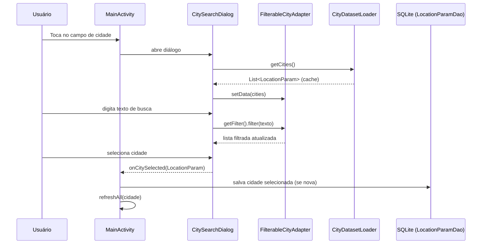

# Spec: Generalizar Cidades Litorâneas com Busca por Autocomplete

**Status**: Done  
**Criado em**: 2026-05-22  
**Projeto**: tabuademares (Android)

---

## 1. Business Context

### Problema

O app atualmente suporta apenas 2 cidades pré-cadastradas no banco (Cabo Frio e Niterói), com mais 3 no mapa de WOEIDs estático (`Const.java`). Usuários de qualquer outro município litorâneo do Brasil não conseguem utilizar o app.

### Objetivo

Expandir o suporte a **todas as cidades litorâneas do Brasil**, com uma experiência de busca intuitiva que permita ao usuário encontrar sua cidade rapidamente sem rolar uma lista extensa.

### Quem é afetado

Usuários de qualquer cidade costeira fora do Rio de Janeiro. O Brasil tem mais de 400 municípios litorâneos distribuídos por 17 estados.

### Requisitos Funcionais

- RF-1: O app deve exibir todas as cidades litorâneas brasileiras como opções de seleção.
- RF-2: O usuário pode filtrar cidades digitando parte do nome.
- RF-3: A busca deve ser tolerante a acentos (ex: "Florianopolis" encontra "Florianópolis").
- RF-4: Cidades adicionadas pelo usuário devem persistir entre sessões.
- RF-5: A cidade selecionada deve ser memorizada como última cidade ativa.
- RF-6: Ao selecionar uma nova cidade, os dados de maré, ondas e clima são recarregados para ela.

### Requisitos Não-Funcionais

- RNF-1: A busca deve responder em < 100ms mesmo com 400+ cidades.
- RNF-2: O dataset de cidades deve funcionar **offline** (embutido no APK).
- RNF-3: O dataset não deve aumentar o APK em mais de 100 KB.

### User Stories

**US-1 — Buscar cidade pelo nome**

> Como usuário em Florianópolis,  
> quero digitar parte do nome da minha cidade no campo de busca,  
> para selecionar minha cidade sem rolar uma lista enorme.

Critérios de Aceite:
- **Dado** que o usuário toca no spinner de cidade  
  **Quando** o painel de seleção abre  
  **Então** um campo de texto de busca é exibido no topo da lista
- **Dado** que o usuário digitou "floria"  
  **Quando** o filtro é aplicado  
  **Então** a lista mostra apenas cidades cujo nome contém "floria" (case-insensitive, sem acento)
- **Dado** que o usuário seleciona "Florianópolis"  
  **Quando** a seleção é confirmada  
  **Então** o painel fecha e os dados de maré/ondas/clima são carregados para Florianópolis

**US-2 — Persistência da cidade selecionada**

> Como usuário,  
> quero que o app lembre minha última cidade selecionada,  
> para não precisar buscar toda vez que abro o app.

Critérios de Aceite:
- **Dado** que o usuário selecionou "Salvador" em uma sessão anterior  
  **Quando** o app é reaberto  
  **Então** "Salvador" aparece pré-selecionada no spinner

### Cenários Chave

| Cenário | Pré-condição | Ação | Resultado Esperado |
|---------|-------------|------|--------------------|
| Happy path — busca e seleciona | App aberto, dataset carregado | Digita "ita" e seleciona "Itajaí" | Dados de maré carregados para Itajaí |
| Busca sem acento | App aberto | Digita "florianopolis" | "Florianópolis" aparece nos resultados |
| Busca sem resultado | App aberto | Digita "xyz123" | Lista exibe mensagem "Nenhuma cidade encontrada" |
| Primeira abertura | App recém-instalado | Abre app | Cabo Frio pré-selecionada (cidade padrão) |
| Cidade nova não tem codeSeaCondition | Usuário seleciona cidade do dataset | API de ondas chamada | API usa lat/long; `codeSeaCondition` e `latExtreme/longExtreme` são atualizados na resposta |

---

## 2. Arch Decisions

### Abordagem Técnica

Substituir o mecanismo de cidades estáticas (hardcoded em `Const.java` e `LocationParamDao`) por um **dataset JSON embutido nos assets do APK**, carregado na inicialização e armazenado em cache em memória. A seleção de cidades utiliza um **Spinner com diálogo customizado** contendo um campo de busca e lista filtrada.

### Plano de Implementação

1. Criar `app/src/main/assets/cidades_litoraneas.json` com todas as cidades litorâneas (nome, estado, lat, long)
2. Criar `CityDatasetLoader` — carrega e faz parse do JSON dos assets, com cache singleton em memória
3. Criar `CitySearchDialog` — `AlertDialog` customizado com `EditText` de busca + `ListView` filtrada
4. Criar `FilterableCityAdapter` — `ArrayAdapter<LocationParam>` com `Filter` que normaliza acentos
5. Atualizar `MainActivity` — o `Spinner` existente é substituído por um `TextView` com ícone de dropdown que abre o `CitySearchDialog` ao ser tocado
6. Atualizar `LocationParamDao` — remover o seed hardcoded de Niterói/Cabo Frio; popular o banco a partir do JSON somente para a cidade padrão na primeira execução
7. Remover `Const.WOEID` — não é mais necessário para a seleção de cidades

### Decisões de Arquitetura

#### Decisão 1 — Dataset embutido como JSON nos assets

**Contexto**: O app precisa de uma lista de 400+ cidades disponível offline.  
**Opções**:
- A) JSON nos assets (escolhida)
- B) API remota (requer internet para busca)
- C) CSV em raw resources  

**Decisão**: JSON nos assets — carregamento único em memória, sem dependência de rede, fácil de atualizar em versões futuras do app.

#### Decisão 2 — Diálogo customizado em vez de Spinner nativo com filtro

**Contexto**: O `Spinner` nativo do Android não suporta filtragem de itens.  
**Opções**:
- A) `AutoCompleteTextView` (substitui o Spinner completamente)
- B) Spinner + diálogo com busca (escolhida)
- C) Terceira biblioteca (ex: SearchableSpinner)  

**Decisão**: Spinner + `AlertDialog` customizado — mantém a aparência atual do app, não adiciona dependências externas, e oferece UX familiar de "toca no campo → abre lista com busca".

#### Decisão 3 — `codeSeaCondition` deixa de ser obrigatório no cadastro de cidade

**Contexto**: O campo `codeSeaCondition` é um Integer que representa o código da estação na API de ondas. Novas cidades do dataset não possuem esse código.  
**Decisão**: Para cidades do dataset, `codeSeaCondition` inicia como `null`. A API de ondas já aceita lat/long diretamente (`SeaConditionCrawlerService`). O campo será preenchido pela resposta da API na primeira consulta (mesmo padrão que `latExtreme/longExtreme` em `ExtremesService`).

#### Decisão 4 — Normalização de acentos no filtro (client-side)

**Contexto**: Usuário pode digitar "Florianopolis" e espera encontrar "Florianópolis".  
**Decisão**: O `Filter` normaliza a string de busca e o nome da cidade via `java.text.Normalizer` + remoção de diacríticos antes de comparar.

### Diagrama de Fluxo — Seleção de Cidade



---

## 3. Technical Contract

### 3.1 Dataset — `assets/cidades_litoraneas.json`

```json
{
  "version": "1.0",
  "cities": [
    {
      "name": "Florianópolis",
      "state": "SC",
      "lat": -27.5954,
      "lng": -48.548
    }
  ]
}
```

**Fonte recomendada**: Base municipal do IBGE filtrada por municípios costeiros (faixa < 50 km do litoral), ou dataset público como `brasil.io`.

### 3.2 Classe `CityDatasetLoader`

```java
package com.novoideal.tabuademares.util;

public class CityDatasetLoader {
    // Singleton com cache
    public static List<LocationParam> load(Context context);
    // Normaliza lat/lng do JSON para LocationParam com codeSeaCondition=null
}
```

**Contrato**:
- Lê `assets/cidades_litoraneas.json` uma única vez por processo (singleton)
- Retorna `List<LocationParam>` com `codeSeaCondition = null`, `woeId = null`
- Lança `RuntimeException` se JSON inválido (asset corrompido)

### 3.3 Classe `CitySearchDialog`

```java
package com.novoideal.tabuademares.ui;

public class CitySearchDialog {
    public interface OnCitySelectedListener {
        void onCitySelected(LocationParam city);
    }

    public static CitySearchDialog newInstance(
        Context context,
        List<LocationParam> cities,
        OnCitySelectedListener listener
    );

    public void show();
}
```

**Contrato**:
- Exibe `AlertDialog` com `EditText` de busca no topo e `ListView` filtrada abaixo
- `EditText` tem hint "Buscar cidade..."
- Filtragem ocorre com debounce de 150ms (evita filtrar a cada tecla)
- Chama `listener.onCitySelected()` ao confirmar seleção
- Fecha o diálogo após seleção

### 3.4 Classe `FilterableCityAdapter`

```java
package com.novoideal.tabuademares.ui;

public class FilterableCityAdapter extends ArrayAdapter<LocationParam> {
    @Override
    public Filter getFilter();
    // Normaliza acentos via Normalizer.normalize(str, NFD) + regex [^\\p{ASCII}]
}
```

**Contrato de filtragem**:
- Input: string digitada pelo usuário
- Normalização: lowercase + remoção de diacríticos em ambos (input e nome da cidade)
- Output: sublista de `LocationParam` cujo nome contém o input normalizado

### 3.5 Atualização em `MainActivity`

- O `Spinner spin_city` é substituído por um `TextView` (ou `Spinner` customizado com adapter vazio) que dispara `CitySearchDialog` ao ser tocado
- `OnCitySelectedListener.onCitySelected(city)` chama o método `refreshAll()` existente
- O label do campo exibe `city.getName() + " - " + formattedDate` (mesmo padrão atual do `toString()`)

### 3.6 Atualização em `LocationParamDao`

**Remover**: seed hardcoded de Niterói e Cabo Frio no `onCreate`  
**Adicionar**: seed apenas de `LocationParam.defaultCity` (Cabo Frio) na primeira execução  
**Manter**: lógica de `updateExtremeParams()` e `updateWeatherParams()` — usada pela API ao resolver a estação mais próxima

### 3.7 Atualização em `SeaConditionCrawlerService` (se necessário)

- Garantir que a requisição à API de ondas **não dependa** de `codeSeaCondition` quando o campo for `null`
- Usar `latitude/longitude` da `LocationParam` como fallback

### 3.8 Remoção de `Const.WOEID`

- `Map<String, String> WOEID` em `Const.java` pode ser removido após confirmar que nenhum serviço ativo o referencia
- `woeId` em `LocationParam` permanece para compatibilidade com cidades já persistidas no banco

---

## Checklist de Aceite

- [ ] Dataset JSON presente em `assets/cidades_litoraneas.json` com 50+ cidades litorâneas de ao menos 5 estados
- [ ] Busca por "floria" retorna "Florianópolis"
- [ ] Busca por "florianopolis" (sem acento) retorna "Florianópolis"
- [ ] Busca vazia exibe todas as cidades
- [ ] Busca sem resultado exibe mensagem "Nenhuma cidade encontrada"
- [ ] Cidade selecionada dispara `refreshAll()` e atualiza todos os 3 fragments (hoje, amanhã, depois)
- [ ] Após fechar e reabrir o app, última cidade selecionada é pré-carregada
- [ ] Nenhuma regressão nas cidades Cabo Frio e Niterói (dados continuam corretos)
- [ ] APK não aumenta mais de 100 KB em relação à versão anterior
