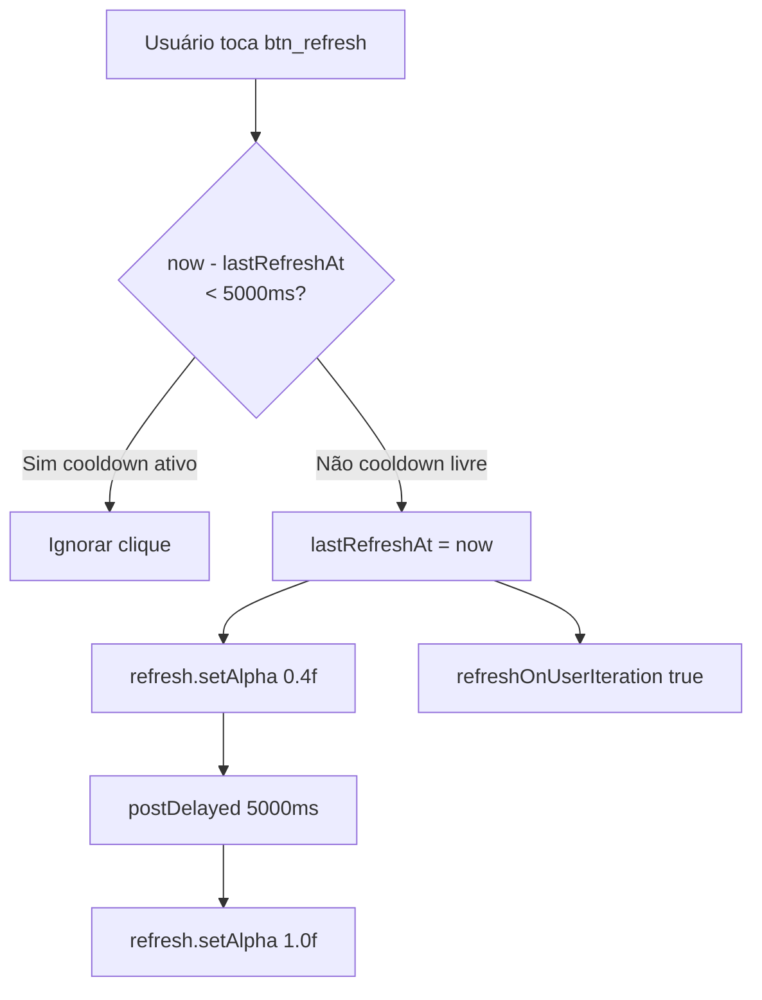

# Refresh Button Debounce

> **Status**: Done
> **Created**: 2026-05-25

## 1. Business Context

### Problem Statement

O botão de refresh (`R.id.btn_refresh`) em `MainActivity.createRefresh()` não possui proteção contra cliques rápidos consecutivos. Cada clique chama `refreshOnUserIteration(true)`, que executa `update()` + `request()` em todos os quatro controllers (Extremes, SeaCondition, Weather, Moon). Como os controllers são assíncronos, dois cliques em sequência disparam duas séries paralelas de web scraping e chamadas HTTP, com risco de:

- Race condition na atualização da UI (dois callbacks chegam fora de ordem e sobrescrevem dados na tela)
- Double-write no banco de dados (dois inserts/updates simultâneos via OrmLite)
- Requisições duplicadas ao `tabuademares.com` (scraping) e às APIs Open-Meteo/OpenMeteoMarine

```java
// MainActivity.java, linha 140-148
private void createRefresh() {
    ImageView refresh = (ImageView) findViewById(R.id.btn_refresh);
    refresh.setOnClickListener(new View.OnClickListener() {
        @Override
        public void onClick(View view) {
            refreshOnUserIteration(true);  // sem qualquer guard
        }
    });
}
```

### Goals

- Garantir que apenas um refresh completo ocorra por vez.
- Feedback visual claro enquanto o refresh está em andamento.
- Preservar o comportamento existente para cliques normais (único clique → refresh completo).

### User Stories

#### US-1: Prevenir refresh duplo por clique rápido

- **Story**: Como usuário, quero que clicar duas vezes rapidamente no botão de refresh não dispare dois reloads simultâneos, para evitar dados inconsistentes na tela.
- **Acceptance Criteria**:
  - **Given** o app está exibindo dados de uma cidade, **when** o usuário clica no botão de refresh duas vezes em menos de 5 segundos, **then** apenas o primeiro clique dispara `refreshOnUserIteration(true)`; o segundo é ignorado.
  - **Given** o primeiro refresh foi disparado, **when** 5 segundos se passam, **then** o botão volta a aceitar cliques normalmente.
  - **Given** o botão está em cooldown, **when** o usuário clica nele, **then** nenhuma requisição de rede é feita e a UI não é alterada.

#### US-2: Feedback visual durante cooldown

- **Story**: Como usuário, quero perceber visualmente que o refresh está em andamento para não clicar novamente por engano.
- **Acceptance Criteria**:
  - **Given** o refresh foi disparado, **when** o cooldown está ativo, **then** o botão de refresh fica com alpha reduzido (`0.4f`) indicando indisponibilidade.
  - **Given** o cooldown expirou, **when** o usuário observa o botão, **then** o alpha volta ao valor normal (`1.0f`).

### Key Scenarios

| Cenário | Pré-condições | Passos | Resultado esperado |
|---|---|---|---|
| Clique único normal | App com dados em tela | Toca o botão de refresh | `refreshOnUserIteration(true)` chamado uma vez; botão fica em cooldown |
| Clique duplo rápido | App com dados em tela | Toca o botão duas vezes em < 1s | Apenas o primeiro dispara refresh; segundo é ignorado silenciosamente |
| Clique após cooldown | Cooldown de 5s expirado | Toca o botão novamente | Novo refresh disparado normalmente |
| Clique durante cooldown | Botão com alpha reduzido | Toca o botão | Clique ignorado; sem requisição de rede |

### Functional Requirements

- FR-1: O listener do botão de refresh deve verificar se `System.currentTimeMillis() - lastRefreshAt < REFRESH_COOLDOWN_MS` antes de chamar `refreshOnUserIteration`.
- FR-2: `REFRESH_COOLDOWN_MS` deve ser **5000 ms** (5 segundos).
- FR-3: Ao disparar o refresh, o botão deve ter seu alpha alterado para `0.4f`; após o cooldown, restaurado para `1.0f` via `postDelayed`.
- FR-4: `lastRefreshAt` deve ser inicializado com `0L` para que o primeiro clique após o app abrir sempre funcione.

### Non-Functional Requirements

- NFR-1: A comparação de tempo deve ser O(1), sem I/O.
- NFR-2: Nenhuma alteração no comportamento de `refreshOnUserIteration()` ou nos controllers.
- NFR-3: A restauração do alpha deve ocorrer na thread principal (uso de `View.postDelayed`).

### Out of Scope

- Indicador de progresso animado (spinner/ProgressBar) durante o refresh.
- Cancelamento de requisições em andamento quando novo refresh é iniciado.
- Debounce para o seletor de cidade (coberto em `skip-reload-same-city.md`).

---

## 2. Arch Decisions

### Proposed Solution

Adicionar um campo `lastRefreshAt` (long) em `MainActivity` e um guard no listener do botão. Ao disparar, atualizar `lastRefreshAt` com o tempo atual e reduzir o alpha do botão. Restaurar o alpha via `View.postDelayed` após o cooldown. Toda a lógica fica encapsulada em `createRefresh()` — zero alterações fora desse método.

### Architecture Overview



### Alternatives Considered

| Alternativa | Prós | Contras | Veredicto |
|---|---|---|---|
| Desabilitar o botão (`setEnabled(false)`) | Simples | Requer re-enable explícito; pode ficar preso se app crashar antes do re-enable | Rejeitado |
| Flag booleana `isRefreshing` | Semântica clara | Precisa ser resetada ao fim dos controllers (assíncronos sem callback unificado) | Rejeitado |
| Timestamp `lastRefreshAt` com `postDelayed` | Simples, sem estado booleano, sem dependência de callback assíncrono | Cooldown fixo (5s), não garante que todos os controllers terminaram | **Aceito** |
| RxJava throttleFirst / debounce | Elegante, reativo | Adiciona dependência não existente no projeto | Rejeitado |

### Risks & Mitigations

| Risco | Impacto | Probabilidade | Mitigação |
|---|---|---|---|
| `postDelayed` vazar para Activity destruída | Baixo | Baixo | Usar `refresh.removeCallbacks(...)` em `onDestroy()` se necessário; impacto mínimo (apenas alpha) |
| 5s insuficiente para controllers assíncronos completarem | Baixo | Médio | Cooldown é proteção contra spam — não é sincronizado com fim do request; aceitável |

### Key Decisions

#### Decision 1: Timestamp-based cooldown com `postDelayed` para restauração do alpha

- **Status**: Aceito
- **Context**: Os controllers são assíncronos e não expõem um callback unificado de "refresh concluído". Sincronizar o re-enable do botão com o fim real do refresh exigiria refatorar todos os controllers.
- **Decision**: Usar cooldown fixo de 5 segundos baseado em timestamp. O visual (alpha) é restaurado via `postDelayed` independente do estado dos controllers.
- **Consequences**: Simples, sem alteração nos controllers. O cooldown pode expirar antes do refresh terminar em conexões lentas, mas isso é aceitável — o importante é evitar spam, não serializar estritamente os requests.

### Implementation Plan

1. Adicionar campo `private long lastRefreshAt = 0L;` em `MainActivity`.
2. Adicionar constante `private static final long REFRESH_COOLDOWN_MS = 5000L;`.
3. Modificar `createRefresh()` para incluir o guard e o feedback visual.
4. Escrever teste unitário verificando que a lógica do guard funciona corretamente.

---

## 3. Technical Contract

### Data Models

Nenhum modelo alterado. Apenas dois campos novos em `MainActivity`:

```java
private static final long REFRESH_COOLDOWN_MS = 5000L;
private long lastRefreshAt = 0L;
```

### Interfaces

**`MainActivity.createRefresh()`** — único método alterado:

```java
private void createRefresh() {
    ImageView refresh = (ImageView) findViewById(R.id.btn_refresh);
    refresh.setOnClickListener(new View.OnClickListener() {
        @Override
        public void onClick(View view) {
            long now = System.currentTimeMillis();
            if (now - lastRefreshAt < REFRESH_COOLDOWN_MS) {
                return;
            }
            lastRefreshAt = now;
            refresh.setAlpha(0.4f);
            refresh.postDelayed(new Runnable() {
                @Override
                public void run() {
                    refresh.setAlpha(1.0f);
                }
            }, REFRESH_COOLDOWN_MS);
            refreshOnUserIteration(true);
        }
    });
}
```

### Integration Points

| Componente | Impacto |
|---|---|
| `refreshOnUserIteration(true)` | Chamado no máximo uma vez por `REFRESH_COOLDOWN_MS` |
| Controllers (Moon, Extremes, SeaCondition, Weather) | Nenhum — sem alteração |
| `R.id.btn_refresh` (ImageView) | Alpha alterado durante cooldown |

### Invariants & Constraints

- `lastRefreshAt` deve ser campo de instância em `MainActivity` (não estático), para ser resetado na recriação da Activity.
- O guard deve ser a primeira instrução do `onClick` — antes de qualquer efeito colateral.
- `refresh.setAlpha(1.0f)` deve ser sempre restaurado via `postDelayed` — nunca dentro de callbacks dos controllers (eles são assíncronos e não garantem execução na UI thread no contexto correto).
