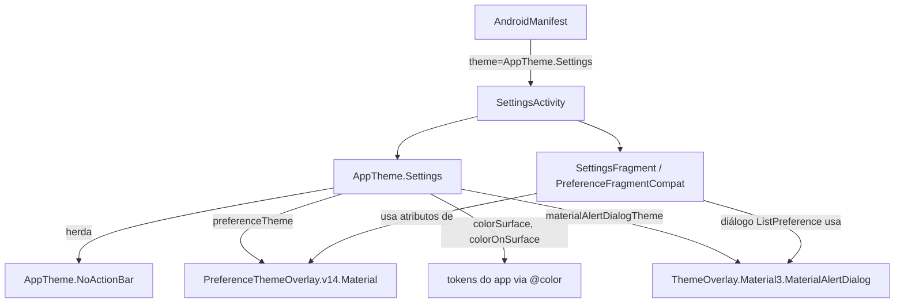

# Settings Visual Polish

> **Status**: Done
> **Created**: 2026-05-25

## 1. Business Context

### Problem Statement

A tela de Configurações e o diálogo de seleção de tema têm problemas visuais que prejudicam a leitura e a coerência com o restante do app:

1. **Contraste insuficiente**: o `PreferenceFragmentCompat` renderiza com as cores padrão do Material Components (`?android:attr/textColorSecondary`), ignorando a paleta customizada do app (`colorOnSurface`, `colorSecondaryText`). No resultado, o texto secundário ("Escuro", "Sistema", "Claro" como sumário) aparece em cinza mal definido sobre o fundo escuro ou claro.
2. **Fundo inconsistente**: o `FrameLayout` container da preferência não declara `background`, herdando a cor da janela (`colorBackground = #F5F7FA` / `#121212`), mas os itens da lista de preferência herdam `colorSurface` do Material (`#FFFFFF` / `#1E1E1E`). A transição entre as duas cores cria uma borda visível e não intencional no topo do fragmento.
3. **Ausência de `preferenceTheme`**: sem essa ponte, o `PreferenceFragmentCompat` não recebe os atributos de cor do tema do app e cai no default do SDK.
4. **Diálogo da `ListPreference` sem estilo Material**: o diálogo usa o `AlertDialog` padrão do Android, sem bordas arredondadas nem cores do tema.

### Goals

- Texto principal e secundário dos itens de preferência com contraste legível em ambos os modos (≥ 4.5:1 WCAG AA).
- Fundo e superfície dos itens de preferência coerentes com o restante do app.
- Diálogo de seleção de tema visualmente alinhado com o Material Design do app.
- Toolbar da `SettingsActivity` idêntica à toolbar da `MainActivity`.
- Zero regressão visual nas outras telas do app.

### User Stories

#### US-1: Leitura clara dos itens de configuração

- **Story**: Como usuário, quero que os textos da tela de Configurações sejam claramente legíveis tanto no tema claro quanto no escuro, sem que as letras se misturem ao fundo.
- **Acceptance Criteria**:
  - **Given** a tela de Configurações aberta em tema claro, **when** o usuário visualiza o item "Tema", **then** o título "Tema" aparece em `colorOnSurface` (#1A1A2E) e o sumário em `colorSecondaryText` (#6B7280), ambos sobre fundo `colorSurface` (#FFFFFF) — contraste ≥ 4.5:1.
  - **Given** a tela de Configurações aberta em tema escuro, **when** o usuário visualiza o item "Tema", **then** o título aparece em `colorOnSurface` (#E8EAF0) e o sumário em `colorSecondaryText` (#9CA3AF), sobre fundo `colorSurface` (#1E1E1E) — contraste ≥ 4.5:1.
  - **Given** qualquer modo, **when** o usuário abre o diálogo de seleção de tema, **then** os três rótulos (Sistema, Claro, Escuro) são legíveis sobre o fundo do diálogo.

#### US-2: Consistência visual entre SettingsActivity e MainActivity

- **Story**: Como usuário, quero que a tela de Configurações siga o mesmo padrão visual do app, para que a navegação pareça coerente.
- **Acceptance Criteria**:
  - **Given** a `SettingsActivity` aberta, **when** o usuário observa a toolbar, **then** ela exibe a mesma cor de fundo e estilo de texto que a toolbar da `MainActivity`.
  - **Given** qualquer modo, **when** o usuário observa a área de conteúdo da tela de Configurações, **then** não há borda ou mudança abrupta de cor entre a toolbar e os itens de preferência.
  - **Given** o diálogo de seleção de tema, **when** o usuário o abre, **then** as bordas são arredondadas e as cores correspondem ao tema ativo (Material AlertDialog).

### Key Scenarios

| Cenário | Pré-condições | Passos | Resultado esperado |
|---|---|---|---|
| Verificar contraste em tema claro | `pref_theme = "light"` | Abrir Configurações | Título "Tema" em #1A1A2E, sumário em #6B7280, fundo branco — legíveis |
| Verificar contraste em tema escuro | `pref_theme = "dark"` | Abrir Configurações | Título em #E8EAF0, sumário em #9CA3AF, fundo #1E1E1E — legíveis |
| Borda indesejada entre toolbar e conteúdo | Qualquer modo | Abrir Configurações | Nenhuma transição visível de cor; conteúdo começa logo abaixo da toolbar |
| Diálogo sem arredondamento | Qualquer modo | Tocar em "Tema" | Diálogo com bordas arredondadas, cores do tema |
| Regressão na MainActivity | Qualquer modo | Navegar para MainActivity após configurar tema | Sem alteração visual nas outras telas |

### Functional Requirements

- FR-1: A `SettingsActivity` deve usar um estilo de tema que inclua `preferenceTheme` apontando para um overlay Material-compatible.
- FR-2: Os itens de preferência devem usar `android:textColor = @color/colorOnSurface` e `android:summary` com `@color/colorSecondaryText`.
- FR-3: O container da preferência deve ter `android:background = ?attr/colorSurface` para eliminar a diferença de fundo.
- FR-4: O diálogo da `ListPreference` deve usar `MaterialAlertDialogBuilder` ou `app:dialogTheme` apontando para um tema de diálogo Material.
- FR-5: A toolbar da `SettingsActivity` deve usar o mesmo estilo e cor que a da `MainActivity`.

### Non-Functional Requirements

- NFR-1: Razão de contraste mínima WCAG AA (4.5:1) para todo texto em ambos os modos.
- NFR-2: As mudanças de tema devem se aplicar exclusivamente à `SettingsActivity` e seus filhos — sem efeito colateral em outras Activities.

### Out of Scope

- Redesenho completo da tela de Configurações (ícones, múltiplas seções, etc.).
- Adição de novas preferências além do tema.
- Mudanças de layout na `MainActivity` ou em outras telas.

---

## 2. Arch Decisions

### Proposed Solution

Criar um estilo `AppTheme.Settings` dedicado para a `SettingsActivity`, que herda de `AppTheme.NoActionBar` e adiciona:
1. `preferenceTheme` apontando para `PreferenceThemeOverlay.v14.Material` — faz o `PreferenceFragmentCompat` usar atributos Material em vez dos padrões Android.
2. Atributos `colorSurface` e `colorOnSurface` explicitamente mapeados para os tokens de cor do app.
3. `materialAlertDialogTheme` para que a `ListPreference` use `MaterialAlertDialog`.

O `activity_settings.xml` recebe `android:background="?attr/colorSurface"` no container, eliminando o gap de cor.

### Architecture Overview



### Alternatives Considered

| Alternativa | Prós | Contras | Veredicto |
|---|---|---|---|
| Alterar `AppTheme` globalmente | Uma mudança resolve tudo | Alto risco de regressão em todas as telas | Rejeitado |
| Layout customizado para cada item de preferência | Controle total | Muito código boilerplate; difícil manter | Rejeitado |
| Substituir `ListPreference` por `MaterialListPreference` (lib externa) | Visual Material 3 nativo | Dependência extra; fora do escopo | Rejeitado |
| Estilo `AppTheme.Settings` isolado | Sem risco de regressão; resolve o problema | Requer definir atributos redundantes | **Aceito** |

### Risks & Mitigations

| Risco | Impacto | Probabilidade | Mitigação |
|---|---|---|---|
| `PreferenceThemeOverlay.v14.Material` sobrescrever texto em outras preferências futuras | Baixo | Baixo | Estilo scoped em `AppTheme.Settings`; testar após adicionar novas prefs |
| `materialAlertDialogTheme` afetar outros diálogos da `SettingsActivity` | Baixo | Baixo | `SettingsActivity` só tem o diálogo da `ListPreference`; sem outros diálogos atualmente |

### Key Decisions

#### Decision 1: Estilo dedicado `AppTheme.Settings` em vez de alterar `AppTheme`

- **Status**: Aceito
- **Context**: Alterar `AppTheme` globalmente para adicionar `preferenceTheme` e atributos de cor poderia introduzir regressões visuais nas telas existentes (MainActivity, SearchLocation).
- **Decision**: Criar `AppTheme.Settings` que herda de `AppTheme.NoActionBar` e adiciona apenas os atributos necessários para a navegação de configurações.
- **Consequences**: Mudanças completamente isoladas; custo mínimo de manutenção; fácil de estender.

#### Decision 2: `PreferenceThemeOverlay.v14.Material` como `preferenceTheme`

- **Status**: Aceito
- **Context**: O `androidx.preference:preference:1.2.1` já presente como dependência inclui este overlay. Ele instrui o `PreferenceFragmentCompat` a usar atributos Material (`colorSurface`, `colorOnSurface`, etc.) para renderizar itens.
- **Decision**: Usar `@style/PreferenceThemeOverlay.v14.Material` como valor de `preferenceTheme` no `AppTheme.Settings`.
- **Consequences**: Os itens de preferência passam a herdar as cores corretas do tema sem precisar de layouts customizados.

### Implementation Plan

1. Adicionar `AppTheme.Settings` em `res/values/styles.xml` com `preferenceTheme`, `colorSurface`, `colorOnSurface` e `materialAlertDialogTheme`.
2. Atualizar `AndroidManifest.xml`: trocar `android:theme` da `SettingsActivity` de `AppTheme.NoActionBar` para `AppTheme.Settings`.
3. Atualizar `activity_settings.xml`: adicionar `android:background="?attr/colorSurface"` no `FrameLayout` de container.
4. Adicionar um estilo `AppTheme.Settings.Preference` para fixar cores de título e sumário caso o overlay não seja suficiente.
5. Verificar visualmente nos dois modos (claro e escuro) antes de commitar.

---

## 3. Technical Contract

### Data Models

Nenhum modelo de dados novo. A alteração é puramente de apresentação.

### Interfaces

**`res/values/styles.xml`** — novo estilo:

```xml
<style name="AppTheme.Settings" parent="AppTheme.NoActionBar">
    <item name="preferenceTheme">@style/PreferenceThemeOverlay.v14.Material</item>
    <item name="colorSurface">@color/colorSurface</item>
    <item name="colorOnSurface">@color/colorOnSurface</item>
    <item name="android:colorBackground">@color/colorSurface</item>
    <item name="materialAlertDialogTheme">@style/ThemeOverlay.MaterialComponents.MaterialAlertDialog</item>
</style>
```

**`AndroidManifest.xml`** — troca de tema:

```xml
<activity
    android:name=".settings.SettingsActivity"
    android:theme="@style/AppTheme.Settings"   <!-- era AppTheme.NoActionBar -->
    ... />
```

**`activity_settings.xml`** — background explícito no container:

```xml
<FrameLayout
    android:id="@+id/settings_container"
    android:background="?attr/colorSurface"     <!-- novo -->
    ... />
```

### Integration Points

| Componente | Como integra |
|---|---|
| `AndroidManifest.xml` | Aponta `SettingsActivity` para `AppTheme.Settings` |
| `styles.xml` | Define `AppTheme.Settings` herdando `AppTheme.NoActionBar` + atributos de preferência |
| `activity_settings.xml` | Container recebe `?attr/colorSurface` para fechar o gap visual |
| `PreferenceFragmentCompat` | Herda automaticamente `preferenceTheme` da Activity pai — sem mudança de código Java |

### Invariants & Constraints

- `AppTheme.Settings` deve sempre herdar de `AppTheme.NoActionBar` (não de `AppTheme` diretamente) para manter o toolbar sem ActionBar padrão.
- O `preferenceTheme` deve ser `PreferenceThemeOverlay.v14.Material` — não substituir por um overlay de versão diferente sem testar.
- Os valores de `colorSurface` e `colorOnSurface` devem sempre vir de `@color/` (resolvidos por qualificador `-night`) e nunca ser hardcoded no estilo.
- Nenhuma mudança deve tocar `AppTheme`, `AppTheme.NoActionBar` ou qualquer estilo usado fora do fluxo de Configurações.
