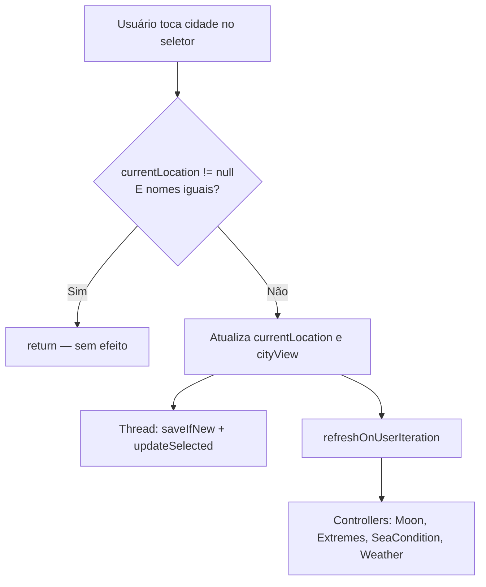

# Skip Reload Same City

> **Status**: Done
> **Created**: 2026-05-25

## 1. Business Context

### Problem Statement

Ao selecionar uma cidade no seletor da `MainActivity`, o método `onCitySelected()` sempre chama `refreshOnUserIteration(false)` sem verificar se a cidade escolhida é a mesma que já está ativa em `currentLocation`. Como resultado, toda vez que o usuário abre o seletor e confirma a mesma cidade, os quatro controllers (Moon, Extremes, SeaCondition, Weather) disparam seus `request()`, fazendo web scraping e chamadas HTTP desnecessárias.

A investigação do código confirmou que não existe nenhuma comparação entre `currentLocation` e `selected` antes do reload:

```java
// MainActivity.java — onCitySelected() — sem guard
currentLocation = cityWithDay;
refreshOnUserIteration(false);  // sempre executa, mesmo para a mesma cidade
```

### Goals

- Eliminar reloads de dados quando o usuário confirma a mesma cidade já selecionada.
- Preservar o comportamento atual para trocas de cidade reais.
- Não alterar a lógica de cache existente nos controllers.

### User Stories

#### US-1: Ignorar seleção da cidade atual

- **Story**: Como usuário, quero que o app não recarregue os dados quando eu abro o seletor e escolho a mesma cidade que já está exibida.
- **Acceptance Criteria**:
  - **Given** a cidade "Cabo Frio" está selecionada e seus dados estão na tela, **when** o usuário abre o seletor e toca em "Cabo Frio" novamente, **then** `refreshOnUserIteration` **não** é chamado e os dados permanecem inalterados.
  - **Given** a cidade "Cabo Frio" está selecionada, **when** o usuário abre o seletor e escolhe "Angra dos Reis", **then** `refreshOnUserIteration` é chamado normalmente e os dados são atualizados para a nova cidade.
  - **Given** nenhuma cidade está selecionada (`currentLocation == null`), **when** o usuário seleciona qualquer cidade, **then** `refreshOnUserIteration` é chamado normalmente (primeira carga).

### Key Scenarios

| Cenário | Pré-condições | Passos | Resultado esperado |
|---|---|---|---|
| Mesma cidade confirmada | "Cabo Frio" ativa, dados na tela | Abre seletor → toca "Cabo Frio" | Sem reload; tela permanece como está |
| Troca de cidade | "Cabo Frio" ativa | Abre seletor → toca "Angra dos Reis" | Reload normal; tela atualiza para nova cidade |
| Primeira seleção | App recém aberto, `currentLocation == null` | Abre seletor → toca qualquer cidade | Reload normal; tela carrega dados |
| `currentLocation` nulo | Estado inicial do app | `onCitySelected()` chamado | Sem NPE; fluxo segue normalmente |

### Functional Requirements

- FR-1: Em `onCitySelected()`, antes de qualquer efeito colateral, comparar o `name` da cidade recebida com o `name` de `currentLocation`. Se forem iguais, retornar imediatamente.
- FR-2: A comparação deve ser nula-segura: se `currentLocation` for `null`, nunca pular o reload.
- FR-3: Nenhum outro comportamento de `onCitySelected()` deve ser alterado.

### Non-Functional Requirements

- NFR-1: Zero regressão nos casos de troca de cidade.
- NFR-2: A comparação deve ser O(1) — sem I/O ou consulta ao banco.

### Out of Scope

- Deduplicação de chamadas dentro dos controllers (já existe cache em BD).
- Alteração da estratégia de cache ou TTL dos dados.
- Otimizações no seletor de cidades (busca, UI).

---

## 2. Arch Decisions

### Proposed Solution

Adicionar uma guarda de entrada no início do callback `onCitySelected()` em `MainActivity.java`. A comparação usa o campo `name` de `LocationParam`, que é o identificador natural da cidade conforme exibido na UI e único no dataset de cidades litorâneas brasileiras.

```java
public void onCitySelected(LocationParam selected) {
    if (currentLocation != null && currentLocation.getName().equals(selected.getName())) {
        return;  // mesma cidade — sem reload
    }
    // restante do fluxo atual, sem alteração
}
```

### Architecture Overview



### Alternatives Considered

| Alternativa | Prós | Contras | Veredicto |
|---|---|---|---|
| Comparar por `id` do OrmLite | Identificador único no BD | `id = 0` para cidades carregadas do JSON antes de salvar no BD; comparação `0 == 0` seria falso positivo para qualquer par de cidades novas | Rejeitado |
| Comparar por latitude + longitude | Mesma lógica de `saveIfNew()` | Mais verbose; Double equality tem riscos com floating-point; `name` é suficiente e mais legível | Rejeitado |
| Comparar por `woeId` ou `codeSeaCondition` | Identificadores de API | Podem ser `null` para algumas cidades | Rejeitado |
| Comparar por `name` | Simples, legível, estável, sem risco de null para cidades com nome | Teóricamente dois locais diferentes poderiam ter o mesmo nome, mas o dataset de cidades litorâneas brasileiras não apresenta duplicatas | **Aceito** |

### Risks & Mitigations

| Risco | Impacto | Probabilidade | Mitigação |
|---|---|---|---|
| Dataset futuro com nomes duplicados | Médio | Muito baixo | O dataset é estático (`assets/cidades_litoraneas.json`); qualquer adição passaria por revisão |
| `currentLocation.getName()` retornar null | Baixo | Muito baixo | Adicionar null-check se necessário (`selected.getName().equals(...)` protege de null em `currentLocation.getName()`) |

### Key Decisions

#### Decision 1: Comparar por `name` em vez de `id`

- **Status**: Aceito
- **Context**: `LocationParam.id` é gerado pelo OrmLite ao salvar no BD. Cidades carregadas do JSON (mas ainda não salvas) têm `id = 0`. Uma comparação por ID causaria falso positivo para qualquer par de cidades novas.
- **Decision**: Usar `getName()` como chave de comparação, pois é o campo preenchido a partir do JSON, exibido na UI, e único no dataset.
- **Consequences**: A guarda é O(1), sem I/O. Funciona mesmo antes de `saveIfNew()` atribuir um ID.

### Implementation Plan

1. Ler `MainActivity.java` — localizar `onCitySelected()` (linha ~216).
2. Inserir guarda no início do método.
3. Escrever teste unitário para `onCitySelected` com mock de `currentLocation`:
   - Mesma cidade → sem chamada a `refreshOnUserIteration`.
   - Cidade diferente → chamada normal.
   - `currentLocation == null` → chamada normal.
4. Verificar que os testes existentes continuam passando.

---

## 3. Technical Contract

### Data Models

Nenhum modelo alterado. A comparação usa `LocationParam.getName()` já existente.

### Interfaces

**`MainActivity.java`** — único ponto de mudança:

```java
// Antes
public void onCitySelected(LocationParam selected) {
    final LocationParam cityWithDay = selected.clone(0);
    // ...
    refreshOnUserIteration(false);
}

// Depois
public void onCitySelected(LocationParam selected) {
    if (currentLocation != null && selected.getName().equals(currentLocation.getName())) {
        return;
    }
    final LocationParam cityWithDay = selected.clone(0);
    // ... restante inalterado
    refreshOnUserIteration(false);
}
```

### Integration Points

| Componente | Impacto |
|---|---|
| `CitySearchDialog.OnCitySelectedListener` | Nenhum — interface não muda |
| `refreshOnUserIteration()` | Chamado apenas quando cidade realmente muda |
| Controllers (Moon, Extremes, SeaCondition, Weather) | Não disparados desnecessariamente |
| `LocationParamService.saveIfNew` / `updateSelected` | Não executados desnecessariamente |

### Invariants & Constraints

- A guarda deve ser a **primeira instrução** de `onCitySelected()` — antes de qualquer efeito colateral (atualização de UI, BD, ou reload).
- `currentLocation == null` nunca deve pular o reload — é o estado de primeira carga.
- Nenhuma alteração fora de `onCitySelected()` em `MainActivity.java`.
