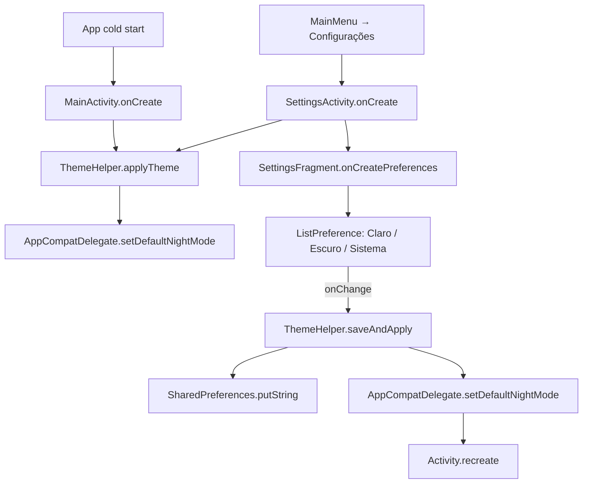

# Theme Settings

> **Status**: Done
> **Created**: 2026-05-25

## 1. Business Context

### Problem Statement

O app já suporta tema escuro via `Theme.MaterialComponents.DayNight`, mas o usuário não tem controle sobre isso: o tema muda só quando o sistema muda. O menu "Configurações" existe na toolbar porém exibe "Ainda não implementado". Usuários que preferem tema escuro independentemente do sistema — ou que querem forçar o tema claro em um dispositivo com dark mode ativo — não têm como fazer isso. A ausência de controle limita a personalização e torna o botão de Configurações inútil.

### Goals

- Usuário pode escolher entre três opções de tema: **Claro**, **Escuro** e **Sistema**.
- A escolha persiste entre sessões do app.
- O tema é aplicado imediatamente ao confirmar a seleção, sem reinicialização manual.
- O menu "Configurações" abre uma tela funcional em vez de mostrar Snackbar.

### User Stories

#### US-1: Selecionar tema nas Configurações

- **Story**: Como usuário, quero escolher o tema do app nas Configurações, para que o visual corresponda à minha preferência independentemente do modo do sistema.
- **Acceptance Criteria**:
  - **Given** o app aberto, **when** o usuário toca em "Configurações" no menu, **then** a tela de Configurações é aberta (não aparece Snackbar).
  - **Given** a tela de Configurações aberta, **when** o usuário visualiza a seção de tema, **then** três opções são exibidas: "Claro", "Escuro" e "Sistema".
  - **Given** qualquer opção selecionada, **when** o usuário confirma, **then** o tema é aplicado imediatamente sem fechar e reabrir o app manualmente.
  - **Given** o app fechado e reaberto, **when** o usuário retorna ao app, **then** o tema previamente escolhido é mantido.

#### US-2: Opção "Sistema" como padrão

- **Story**: Como usuário novo, quero que o app siga o tema do sistema por padrão, para que minha experiência inicial seja coerente com o restante do dispositivo.
- **Acceptance Criteria**:
  - **Given** primeiro acesso ao app (sem preferência salva), **when** o usuário abre o app, **then** o tema segue a configuração do sistema operacional.
  - **Given** tema "Sistema" selecionado, **when** o usuário altera o dark mode nas configurações do Android, **then** o app muda de tema automaticamente.

### Key Scenarios

| Cenário | Pré-condições | Passos | Resultado esperado |
|---|---|---|---|
| Ativar tema escuro manualmente | App com tema "Sistema", sistema em modo claro | Abrir Configurações → selecionar "Escuro" → confirmar | App muda imediatamente para tema escuro; próxima abertura mantém o tema escuro |
| Retornar ao tema do sistema | App com tema "Escuro" forçado | Abrir Configurações → selecionar "Sistema" → confirmar | App volta a seguir o sistema; se sistema estiver claro, app fica claro |
| Primeira instalação | App recém-instalado, sistema em dark mode | Abrir o app | Tema escuro aplicado automaticamente (padrão "Sistema") |
| Troca de tema sem perda de estado | Qualquer tema, visualizando aba de Maré | Abrir Configurações → trocar tema → confirmar | Activity recria; usuário retorna à aba de Maré com os dados preservados |

### Functional Requirements

- FR-1: A tela de Configurações deve estar acessível pelo menu "Configurações" na toolbar da `MainActivity`.
- FR-2: A seção de tema deve apresentar as opções: **Sistema** (padrão), **Claro**, **Escuro**.
- FR-3: A escolha do tema deve ser persistida em `SharedPreferences`.
- FR-4: A mudança de tema deve chamar `AppCompatDelegate.setDefaultNightMode()` e recriar a `Activity` atual.
- FR-5: O tema selecionado deve ser aplicado em `MainActivity.onCreate` antes do `setContentView`.

### Non-Functional Requirements

- NFR-1: A transição de tema não deve causar flash branco visível por mais de um frame.
- NFR-2: A tela de Configurações deve ser navegável com TalkBack (acessibilidade).
- NFR-3: A opção selecionada deve ter indicação visual clara do estado atual.

### Out of Scope

- Outras configurações além do tema (notificações, unidades de medida, etc.).
- Temas customizados além de claro/escuro/sistema.
- Suporte a Android abaixo da API 15 para dark mode (comportamento de fallback é seguir "Claro").

---

## 2. Arch Decisions

### Proposed Solution

Criar uma `SettingsActivity` com um `PreferenceFragmentCompat` contendo uma `ListPreference` para seleção de tema. A preferência é armazenada em `SharedPreferences` default. A `MainActivity` lê a preferência no `onCreate` e chama `AppCompatDelegate.setDefaultNightMode()` para aplicar o tema antes do layout ser inflado. A `SettingsActivity` também aplica o tema salvo no `onCreate` para garantir consistência visual.

### Architecture Overview



### Alternatives Considered

| Alternativa | Prós | Contras | Veredicto |
|---|---|---|---|
| `AlertDialog` com RadioGroup | Simples, menos código | Não escala para futuras configurações; fora do padrão Settings do Android | Rejeitado |
| `BottomSheetDialog` | Visual moderno, fácil UX | Mesmo problema de escalabilidade; sem integração nativa com Preferences | Rejeitado |
| `PreferenceFragmentCompat` em `SettingsActivity` | Padrão Android, escalável, acessível por padrão, fácil de extender | Requer `activity_settings.xml` e entrada no Manifest | **Aceito** |

### Risks & Mitigations

| Risco | Impacto | Probabilidade | Mitigação |
|---|---|---|---|
| Flash branco na transição de tema | Médio | Médio | Aplicar `AppCompatDelegate` antes do `setContentView`; usar `android:windowBackground` coerente no tema |
| Perda da aba ativa no `recreate()` | Baixo | Alto | Salvar o índice da aba em `onSaveInstanceState` e restaurar no `onCreate` |
| Inconsistência visual na `SettingsActivity` | Baixo | Baixo | `SettingsActivity.onCreate` chama `ThemeHelper.applyTheme` antes do super |

### Key Decisions

#### Decision 1: `ThemeHelper` como classe utilitária estática

- **Status**: Aceito
- **Context**: A lógica de ler SharedPreferences e chamar `AppCompatDelegate.setDefaultNightMode()` será chamada de pelo menos duas Activities (`MainActivity` e `SettingsActivity`). Duplicar essa lógica gera risco de inconsistência.
- **Decision**: Criar `util/ThemeHelper.java` com métodos estáticos `applyTheme(Context)` e `saveAndApply(Context, String)`.
- **Consequences**: Ponto único para alterar a lógica de tema; sem dependência de DI ou ciclo de vida.

#### Decision 2: Usar `ListPreference` padrão do AndroidX Preference

- **Status**: Aceito
- **Context**: A UI de seleção de tema pode ser implementada com componentes customizados ou com o sistema de Preferences padrão do AndroidX.
- **Decision**: Usar `androidx.preference:preference:1.2.x` com `ListPreference`, que fornece diálogo de seleção nativo, bind automático ao `SharedPreferences`, e suporte a TalkBack sem código adicional.
- **Consequences**: Adicionar a dependência `androidx.preference:preference:1.2.1` ao `build.gradle`. O visual padrão do diálogo de `ListPreference` não é Material 3 puro, mas é funcional e acessível.

### Implementation Plan

1. Adicionar dependência `androidx.preference:preference:1.2.1` ao `app/build.gradle`.
2. Criar `util/ThemeHelper.java` com a lógica de leitura e aplicação do tema.
3. Atualizar `MainActivity.onCreate` para chamar `ThemeHelper.applyTheme` antes do `super.onCreate` (ou imediatamente após, antes de `setContentView`).
4. Criar `res/xml/preferences.xml` com a `ListPreference` de tema.
5. Criar `SettingsFragment extends PreferenceFragmentCompat`.
6. Criar `SettingsActivity` com `SettingsFragment` como conteúdo; registrar no `AndroidManifest.xml`.
7. Atualizar o handler do menu em `MainActivity` para fazer `startActivity(SettingsActivity)`.
8. Adicionar strings PT-BR: rótulos de opções e título da tela.
9. Salvar/restaurar índice da aba ativa no `MainActivity` via `onSaveInstanceState`.

---

## 3. Technical Contract

### Data Models

**SharedPreferences** (arquivo default, `Context.getSharedPreferences`):

| Chave | Tipo | Valores possíveis | Padrão |
|---|---|---|---|
| `pref_theme` | `String` | `"system"`, `"light"`, `"dark"` | `"system"` |

### Interfaces

**`util/ThemeHelper.java`**

```java
public class ThemeHelper {
    static final String PREF_THEME = "pref_theme";
    static final String THEME_LIGHT  = "light";
    static final String THEME_DARK   = "dark";
    static final String THEME_SYSTEM = "system";

    // Lê SharedPreferences e aplica o modo via AppCompatDelegate.
    // Chamar em onCreate() de toda Activity, antes de setContentView().
    public static void applyTheme(Context context);

    // Persiste o valor em SharedPreferences e chama applyTheme.
    // Retorna o AppCompatDelegate mode int aplicado.
    public static int saveAndApply(Context context, String themeValue);
}
```

**`res/xml/preferences.xml`**

```xml
<PreferenceScreen>
  <ListPreference
      app:key="pref_theme"
      app:title="@string/pref_theme_title"
      app:entries="@array/pref_theme_entries"
      app:entryValues="@array/pref_theme_values"
      app:defaultValue="system"
      app:useSimpleSummaryProvider="true" />
</PreferenceScreen>
```

**String arrays em `res/values/strings.xml`**:

```xml
<string-array name="pref_theme_entries">
    <item>Sistema</item>
    <item>Claro</item>
    <item>Escuro</item>
</string-array>
<string-array name="pref_theme_values">
    <item>system</item>
    <item>light</item>
    <item>dark</item>
</string-array>
```

### Integration Points

| Ponto | Como integra |
|---|---|
| `MainActivity.onCreate` | Chama `ThemeHelper.applyTheme(this)` antes de `setContentView` |
| `MainActivity.onOptionsItemSelected` | Substitui o Snackbar "não implementado" por `startActivity(new Intent(this, SettingsActivity.class))` |
| `SettingsActivity.onCreate` | Chama `ThemeHelper.applyTheme(this)` para garantir tema correto na própria tela de configurações |
| `SettingsFragment.onPreferenceChange` | Chama `ThemeHelper.saveAndApply` e depois `requireActivity().recreate()` |
| `AndroidManifest.xml` | Declara `SettingsActivity` com tema `@style/AppTheme.NoActionBar` |

### Invariants & Constraints

- O `ThemeHelper.applyTheme` deve ser chamado **antes** de qualquer `setContentView` em toda Activity que precisar refletir o tema salvo.
- O valor de `pref_theme` no `SharedPreferences` deve ser sempre um dos três valores definidos (`"system"`, `"light"`, `"dark"`); qualquer valor não reconhecido deve ser tratado como `"system"`.
- O índice da aba ativa na `MainActivity` deve ser preservado através do `recreate()` para evitar regressão de UX.
