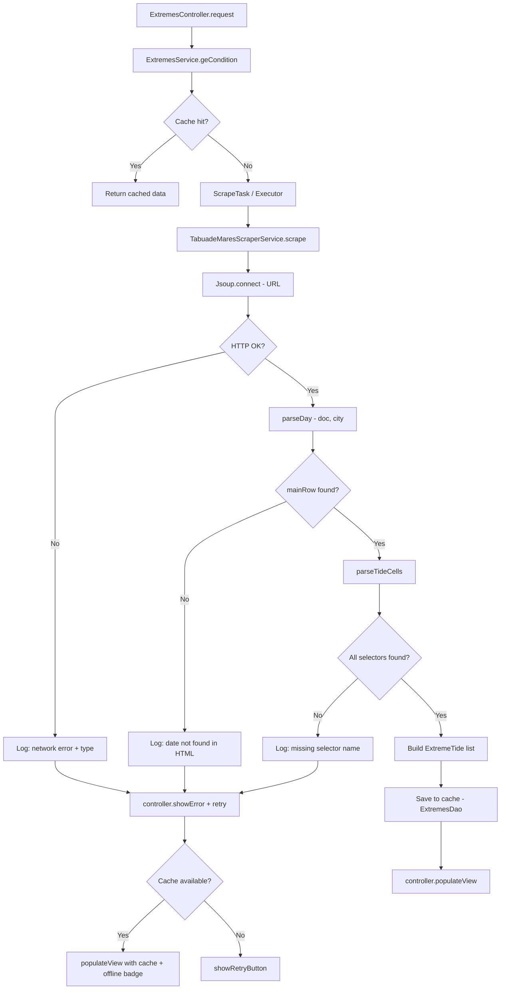

# Tide Table Scraper Fix

> **Status**: Draft
> **Created**: 2026-06-02

## 1. Business Context

### Problem Statement

A tabela de marés do app parou de exibir dados para os usuários. O recurso central do aplicativo — previsão de marés para cidades litorâneas brasileiras — está silenciosamente falhando: o usuário abre o app, seleciona uma cidade, e não vê nenhum dado de maré, apenas uma mensagem genérica ("no tide data").

A implementação atual faz scraping HTML do site `tabuademares.com` usando seletores CSS específicos (`tabla_mareas_*`). Qualquer mudança na estrutura HTML do site quebra o scraper sem aviso algum — e sem mecanismo de diagnóstico para entender o que falhou.

### Goals

- Identificar e corrigir a causa raiz da falha atual do scraper.
- Tornar o scraper resiliente a mudanças futuras na estrutura HTML do site.
- Fornecer feedback de erro útil ao usuário em vez de silêncio ou mensagem genérica.
- Adicionar observabilidade suficiente para diagnosticar falhas futuras em menos de 5 minutos.

### User Stories

#### US-1: Ver tabela de marés funcional

- **Story**: Como usuário do app, quero ver os horários e alturas das marés do dia para a cidade selecionada, para planejar atividades na praia.
- **Acceptance Criteria**:
  - **Given** o usuário está com conexão à internet, **when** abre o app com qualquer cidade que tenha `tabuademaresPath` configurado, **then** os extremos de maré do dia são exibidos na aba de marés.
  - **Given** o scraper retorna uma lista vazia, **when** o app exibe o estado de erro, **then** a mensagem informa claramente que não foi possível carregar os dados de maré (diferenciando de "cidade sem dados").

#### US-2: Diagnóstico rápido de falhas

- **Story**: Como desenvolvedor, quero logs estruturados do scraper para entender por que falhou sem precisar reproduzir o ambiente.
- **Acceptance Criteria**:
  - **Given** o scraper falha por qualquer motivo, **when** o erro é capturado, **then** o log inclui: URL acessada, tipo de falha (rede vs. parsing vs. estrutura HTML), e — quando for parsing — qual seletor CSS não encontrou nenhum elemento.
  - **Given** o scraper executa com sucesso, **when** completa o parse, **then** o log registra a quantidade de extremos encontrados e o HTML usado para seleção da linha de data.

#### US-3: Fallback para dados em cache

- **Story**: Como usuário do app, quero ver dados de maré mesmo quando o scraping falha, desde que existam dados em cache recentes.
- **Acceptance Criteria**:
  - **Given** existem dados de maré em cache SQLite para a cidade e data, **when** o scraper falha por qualquer razão, **then** o app exibe os dados em cache com indicador visual de que são dados offline.
  - **Given** não há dados em cache e o scraper falha, **when** o app exibe mensagem de erro, **then** oferece opção de tentar novamente (retry).

### Key Scenarios

| Scenario | Pre-conditions | Steps | Expected Result |
|---|---|---|---|
| Happy path — scraper OK | Cidade com `tabuademaresPath`, conexão ativa, site com estrutura esperada | Usuário abre aba de marés | 3–5 extremos exibidos com hora e altura |
| Site mudou HTML | Site alterou classes CSS dos seletores | App tenta scrape | Log com seletor que falhou; usuário vê erro com opção de retry |
| Site fora do ar / timeout | Sem conectividade ou site indisponível | App tenta scrape | Timeout em 15s; se há cache → exibe cache com badge "offline"; se não há → mensagem de erro com retry |
| Cidade sem caminho configurado | `tabuademaresPath` nulo ou vazio | Scrape solicitado | Lista vazia retornada silenciosamente; UI exibe "dados não disponíveis para esta cidade" |
| Data não encontrada no HTML | Site aberto mas a data alvo não existe na tabela mensal | Parse procura `tr` com data | Lista vazia; log registra a data buscada e confirma que o `mainRow` foi `null` |
| Cache hit | Dados do dia já salvos no SQLite | App abre aba de marés | Dados retornados do banco local; sem chamada de rede |

### Functional Requirements

1. O scraper deve usar CSS selectors robustos. Se os seletores primários falharem, tentar seletores alternativos antes de desistir.
2. O serviço deve distinguir e logar separadamente: falha de rede, timeout, e falha de parsing.
3. A UI deve mostrar um estado de erro específico para falha de scraping, com botão de retry.
4. Deve existir pelo menos um teste unitário exercendo o `TabuadeMaresScraperService` com HTML mockado (representando a estrutura atual do site).
5. O `AsyncTask` (deprecated desde API 30) deve ser migrado para `java.util.concurrent.Executor` ou similar.

### Non-Functional Requirements

- Timeout de rede: mantido em 15 segundos.
- Sem dados de usuário transmitidos ao site externo (scraping anônimo).
- O fix não deve alterar o schema do banco de dados (sem nova migração de versão).

### Out of Scope

- Substituição do scraping por uma API paga de dados de marés.
- Suporte a múltiplos idiomas nas mensagens de erro.
- Notificações push sobre falhas do scraper.

---

## 2. Arch Decisions

### Proposed Solution

**Fase 1 — Diagnóstico:** Inspecionar o HTML atual de `tabuademares.com` para uma cidade conhecida e comparar com os seletores CSS hardcoded no `TabuadeMaresScraperService`. Identificar se o `tr[onclick]` com `Day('yyyy-MM-dd')`, `td.tabla_mareas_marea`, `div.tabla_mareas_marea_hora`, `div.tabla_mareas_marea_bajamar`, e `span.tabla_mareas_marea_altura_numero` ainda existem.

**Fase 2 — Fix do scraper:** Atualizar os seletores para refletir a estrutura atual do site. Adicionar seletores alternativos (fallback) para os elementos críticos — hora e tipo de maré — usando atributos de dados ou estrutura hierárquica como alternativa às classes CSS.

**Fase 3 — Observabilidade:** Adicionar logging estruturado em cada ponto de falha do pipeline de parsing. Criar constante para cada seletor CSS para facilitar manutenção futura.

**Fase 4 — Resiliência da UI:** Migrar de `AsyncTask` para `Executor`; adicionar feedback de erro com retry no `ExtremesController`; exibir dados em cache quando disponíveis mesmo após falha de scraping.

**Fase 5 — Teste:** Adicionar `TabuadeMaresScraperServiceTest` com HTML de exemplo cobrindo os cenários principais.

### Architecture Overview



### Alternatives Considered

| Alternative | Pros | Cons | Verdict |
|---|---|---|---|
| Substituir scraping por API pública (ex: Open-Meteo Marine, Stormglass) | Dados confiáveis, contrato estável | Custo, quota, requer chave de API, possível cobertura limitada para cidades brasileiras pequenas | Rejeitado para este fix (fora de escopo); pode ser avaliado no futuro |
| Usar WebView para renderizar o site e extrair dados via JS | Contorna mudanças de HTML puro | Muito mais lento; overhead de WebView; difícil de testar | Rejeitado |
| Cache agressivo (TTL de 24h) como única mitigação | Simples de implementar | Não resolve o problema quando o cache expira; mascara a falha | Rejeitado como solução isolada |
| Manter `AsyncTask` | Sem refactor | API deprecated, remova em SDK 34+ | Migrar junto com o fix |

### Risks & Mitigations

| Risk | Impact | Likelihood | Mitigation |
|---|---|---|---|
| `tabuademares.com` reestrutura HTML novamente | Alto — app quebra de novo | Médio | Logging de seletores + constantes nomeadas facilitam hotfix em minutos |
| Site bloqueia o user agent atual | Alto | Baixo | Rotacionar user agents; adicionar headers mais realistas |
| `jsoup` não consegue parsear HTML dinâmico (JS-rendered) | Alto | Médio | Verificar se conteúdo está presente no HTML estático; se não, avaliar API alternativa |
| Migração de `AsyncTask` introduz regressão | Médio | Baixo | Cobrir com teste unitário do fluxo completo |

### Key Decisions

#### Decision 1: Seletores CSS como constantes nomeadas

- **Status**: Accepted
- **Context**: Os seletores CSS estão hardcoded como strings literais espalhadas em `parseTideCells` e `parseDay`. Qualquer mudança exige varrer o código para encontrá-los.
- **Decision**: Extrair todos os seletores para constantes privadas estáticas no topo de `TabuadeMaresScraperService` (ex: `CSS_ROW_ONCLICK`, `CSS_TD_EXTREME`, `CSS_DIV_HORA`, `CSS_DIV_BAJAMAR`, `CSS_SPAN_HEIGHT`).
- **Consequences**: Facilita identificar qual seletor falhou no log; centraliza manutenção futura.

#### Decision 2: Migração de AsyncTask para Executor

- **Status**: Accepted
- **Context**: `AsyncTask` foi depreciado no Android API 30 e pode ser removido em versões futuras do SDK. O projeto já tem Min SDK 15, mas Target SDK 34.
- **Decision**: Substituir `ScrapeTask extends AsyncTask` por um `Executor` com callback via `Handler(Looper.getMainLooper())` para o `onPostExecute` equivalente.
- **Consequences**: Código mais moderno e sem warnings de deprecação; comportamento idêntico ao usuário.

#### Decision 3: Não adicionar novo nível de cache além do existente

- **Status**: Accepted
- **Context**: Já existe cache via `ExtremesDao`/SQLite. Adicionar cache HTTP ou cache de HTML seria complexidade extra sem benefício proporcional.
- **Decision**: Aproveitar o cache SQLite existente como fallback quando o scraper falha. Se há dados do dia no banco, exibi-los mesmo em caso de erro de rede/parsing.
- **Consequences**: Usuário vê dados possivelmente desatualizados em vez de tela vazia; comportamento claramente comunicado por badge visual.

### Implementation Plan

1. **Diagnóstico manual**: Fazer fetch do HTML de `https://tabuademares.com/br/rio-de-janeiro/cabo-frio` e inspecionar os seletores. Documentar o que mudou.
2. **Atualizar seletores** em `TabuadeMaresScraperService` + extrair constantes.
3. **Adicionar logging** estruturado para cada ponto de falha.
4. **Migrar AsyncTask → Executor** em `ExtremesService`.
5. **Atualizar `ExtremesController`**: exibir cache em falha; adicionar botão retry.
6. **Adicionar `TabuadeMaresScraperServiceTest`** com HTML mockado.
7. **Testar** no emulador com cidade válida e com cidade sem `tabuademaresPath`.

---

## 3. Technical Contract

### Data Models

Sem alteração no schema. `ExtremeTide` e `LocationParam` permanecem como estão.

### Interfaces

#### `TabuadeMaresScraperService` (atualizado)

```java
public class TabuadeMaresScraperService {

    // CSS selectors — centralizados para facilitar manutenção
    static final String CSS_ROW_ONCLICK   = "tr[onclick]";
    static final String CSS_TD_EXTREME    = "td.tabla_mareas_marea";
    static final String CSS_TD_EXTRA      = "td.tabla_mareas_marea_mas_cuatro";
    static final String CSS_DIV_HORA      = "div.tabla_mareas_marea_hora";
    static final String CSS_DIV_BAJAMAR   = "div.tabla_mareas_marea_bajamar";
    static final String CSS_SPAN_HEIGHT   = "span.tabla_mareas_marea_altura_numero";

    /**
     * Fetches and parses tide extremes for the given city and date.
     *
     * @throws IOException      on network failure or HTTP error
     * @throws ParseException   when the HTML structure does not match expected selectors
     */
    public List<ExtremeTide> scrape(LocationParam city) throws IOException, ParseException;
}
```

**Comportamento de erro:**
- Lança `IOException` para falhas de rede/timeout — `ExtremesService` loga e trata.
- Lança `ParseException` (nova exceção checked) quando nenhum elemento é encontrado para um seletor crítico — permite distinguir "site fora" de "site mudou".

#### `ExtremesService` (atualizado)

```java
public class ExtremesService {

    /**
     * Returns cached data immediately if available.
     * Triggers async scrape in background; result delivered via callback
     * (controller.populateView ou controller.showScrapeError).
     */
    public List<ExtremeTide> geCondition(LocationParam city);

    /**
     * Retries a previously failed scrape for the same city/date.
     */
    public void retry(LocationParam city);
}
```

#### `ExtremesController` (atualizado)

```java
public interface ExtremesController extends BaseController {

    /** Called when scraping fails and no cached data is available. */
    void showScrapeError(String reason, Runnable onRetry);

    /** Called when displaying cached data after scrape failure. */
    void populateViewFromCache(List<ExtremeTide> cached);
}
```

### Integration Points

| Ponto | Descrição |
|---|---|
| `tabuademares.com` | Site externo; scraping via jsoup HTTPS GET; nenhum contrato formal — frágil por natureza |
| `ExtremesDao` / SQLite | Cache local; consultado antes do scrape; populado após scrape bem-sucedido |
| `MainActivity` | Dispara `ExtremesController.request()` por aba/dia; não muda neste fix |
| `R.string` resources | Novas strings de erro adicionadas para mensagem de falha de scraping e retry |

### Invariants & Constraints

- `tabuademaresPath` nunca nulo/vazio ao chamar `scrape()` — validado em `geCondition` antes de criar a task.
- Deduplicação de extremos mantida: `ExtremesDao.contains()` usa janela de ±5 minutos em `fullDate`.
- Nenhuma operação de rede no main thread — todo scraping permanece em thread de background.
- Sem alteração de versão de banco de dados (sem nova migração).
