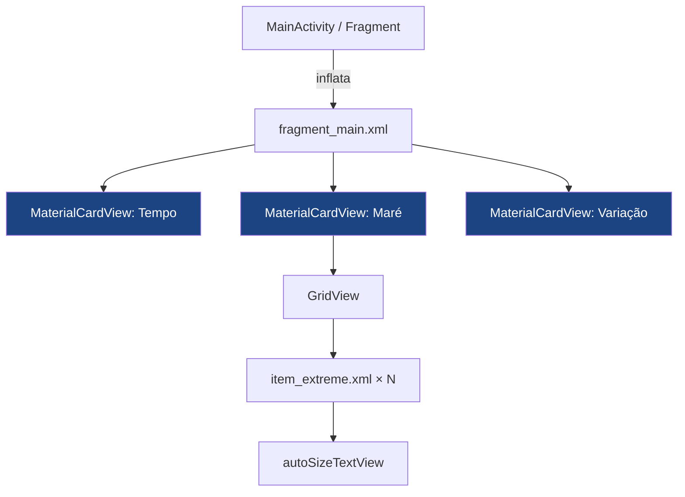

# Visual Harmonization

> **Status**: Done
> **Created**: 2026-05-22

## 1. Business Context

### Problem Statement

A UI do app tem inconsistências visuais e problemas técnicos acumulados que prejudicam a experiência do usuário: seções sem separação visual clara, dimensões fixas que não se adaptam quando há 5–6 marés no dia, textos em `dp` que ignoram o tamanho de fonte do sistema, áreas de toque abaixo do mínimo recomendado e ausência de tema escuro. Além disso, o seletor de cidade na toolbar aparece como texto simples sem nenhuma indicação visual de que é tocável — usuários não descobrem naturalmente que podem buscar outra cidade. O conjunto torna o app visualmente datado, menos acessível e com discoverability baixa.

### Goals

- Todas as seções (Tempo, Maré, Variação) separadas por cards com elevação e bordas arredondadas.
- Texto dos cards de maré se ajusta automaticamente quando há 5 ou 6 extremos (sem clipar).
- Tema escuro funcional que segue a configuração do sistema (Android 10+).
- Todos os tamanhos de texto em `sp` para respeitar a preferência de acessibilidade do usuário.
- Toolbar ≥ 56 dp e TabLayout ≥ 48 dp (mínimo de área de toque Material Design).
- Zero bugs de layout identificados na análise (wrap_content incorreto, margem 50sp na tabela, adapter com reuso quebrado).
- Seletor de cidade na toolbar com affordance visual clara — ícone de localização + seta — indicando que é tocável e abre busca.

### User Stories

#### US-1: Cards de seção com hierarquia visual clara

- **Story**: Como usuário, quero ver cada bloco de informação (Tempo, Maré, Variação) em um card separado, para identificar rapidamente onde começa e termina cada seção.
- **Acceptance Criteria**:
  - **Given** o fragmento carregado, **when** o usuário visualiza a tela, **then** cada seção exibe um `MaterialCardView` com elevação de 2dp e raio de 12dp.
  - **Given** qualquer seção, **when** o conteúdo é renderizado, **then** o título da seção aparece acima do card (fora do background colorido), com cor diferenciada do corpo.
  - **Given** tema claro, **when** o app abre, **then** o fundo da tela é `#F5F7FA` e os cards são brancos.
  - **Given** tema escuro, **when** o app abre, **then** o fundo é `#121212` e os cards são `#1E1E1E`.

#### US-2: Cards de extremo de maré adaptativos

- **Story**: Como usuário, quero que os cards de Baixa/Alta sempre mostrem todos os dados legíveis, independentemente de ter 4, 5 ou 6 marés no dia.
- **Acceptance Criteria**:
  - **Given** 4 extremos no dia, **when** o grid é renderizado, **then** cada card exibe tipo, horário, ícone e altura sem clipar, com `textSize` máximo.
  - **Given** 6 extremos no dia, **when** o grid é renderizado, **then** o texto escala para baixo automaticamente via `autoSizeText` (mín 9sp, máx 18sp) e o grid cresce para `wrap_content`.
  - **Given** qualquer quantidade de extremos, **when** o card é renderizado, **then** a ordem é: tipo → horário → ícone (↑ ou ↓) → altura.
  - **Given** card de Baixa, **when** renderizado, **then** o ícone exibe `tide_down`; para Alta exibe `tide_hight`.

#### US-3: Modo escuro automático

- **Story**: Como usuário que usa o celular no modo escuro, quero que o app respeite essa configuração, para não machucar os olhos à noite.
- **Acceptance Criteria**:
  - **Given** Android 10+ com modo escuro ativado, **when** o app abre, **then** o tema escuro é aplicado automaticamente sem reiniciar o app.
  - **Given** modo escuro ativo, **when** qualquer tela é exibida, **then** texto principal é branco, texto secundário é `#B0B0B0`, cards têm fundo `#1E1E1E`.
  - **Given** modo escuro ativo, **when** a seção de Maré é exibida, **then** os cards de extremo mantêm o azul primário como fundo, com texto branco.
  - **Given** mudança de tema no sistema, **when** o app está em background e volta ao foreground, **then** o tema atualiza sem crash.

#### US-7: Estado vazio persistente na seção de Maré

- **Story**: Como usuário, quero ver uma mensagem clara quando não há dados de maré disponíveis para a cidade selecionada, para não confundir com dados de uma cidade anterior.
- **Acceptance Criteria**:
  - **Given** uma cidade sem `tabuademaresPath` (ex: Arraial do Cabo), **when** a tela é carregada, **then** o GridView fica oculto e um estado vazio exibe ícone de maré + texto "Dados de marés não disponíveis para esta cidade".
  - **Given** uma cidade com path válido mas sem dados para a data consultada, **when** o scraper retorna lista vazia, **then** o GridView fica oculto e o estado vazio exibe "Sem dados de maré para esta data" — substituindo o Toast transitório atual.
  - **Given** o usuário troca de cidade, **when** `refreshAll` é disparado, **then** o GridView é limpo imediatamente (antes da requisição terminar), evitando que dados da cidade anterior fiquem visíveis durante o carregamento.
  - **Given** o estado vazio visível, **when** o usuário troca para uma cidade com dados, **then** o estado vazio some e o GridView com os extremos é exibido normalmente.
  - **Given** tema escuro ativo, **when** o estado vazio é renderizado, **then** texto e ícone seguem as cores do tema (texto `colorSecondaryText`, ícone `colorPrimary`).

#### US-6: Dialog de busca de cidade harmonizado

- **Story**: Como usuário buscando uma cidade, quero ver uma lista limpa e legível com cidade e estado bem distinguíveis, para encontrar minha praia rapidamente.
- **Acceptance Criteria**:
  - **Given** o dialog de busca aberto, **when** a lista é exibida, **then** cada item mostra o nome da cidade em texto principal (bold, 15sp, escuro) e o estado em texto secundário (13sp, cinza), alinhados à esquerda.
  - **Given** qualquer item da lista, **when** renderizado, **then** o fundo é branco (tema claro) ou `#1E1E1E` (tema escuro), sem gradiente azul-roxo.
  - **Given** o dialog de busca, **when** aberto pelo usuário, **then** usa `MaterialAlertDialogBuilder` para herdar o tema DayNight (dark mode automático).
  - **Given** o campo de busca, **when** renderizado, **then** envolto em `TextInputLayout` com hint "Buscar cidade..." e ícone de lupa.
  - **Given** um item selecionado, **when** o usuário toca nele, **then** o comportamento atual (fecha dialog, atualiza dados) é mantido sem alteração.
  - **Given** modo escuro ativo, **when** o dialog é exibido, **then** fundo do dialog é escuro, texto é claro, campo de busca segue tema Material.

#### US-5: Seletor de cidade com affordance visual clara

- **Story**: Como usuário novo, quero que fique óbvio que posso trocar a cidade na barra superior, para encontrar informações de maré do local onde estou.
- **Acceptance Criteria**:
  - **Given** o app aberto, **when** o usuário olha para a toolbar, **then** o nome da cidade aparece com ícone de localização à esquerda e seta para baixo (▾) à direita.
  - **Given** o usuário toca na área do seletor, **when** o toque é registrado, **then** o dialog de busca de cidade abre (comportamento atual mantido).
  - **Given** tema claro ou escuro, **when** a toolbar é renderizada, **then** ícone, texto e seta são sempre brancos e legíveis sobre o fundo azul.
  - **Given** nome de cidade longo (ex: "Armação dos Búzios - RJ"), **when** renderizado na toolbar, **then** o texto é truncado com ellipsis e não empurra a seta para fora da tela.
  - **Given** a área tocável do seletor, **when** medida, **then** tem largura mínima de 120dp e altura total da toolbar (≥ 56dp) para facilitar o toque.

#### US-4: Tipografia e toque acessíveis

- **Story**: Como usuário com configuração de fonte grande no sistema, quero que os textos do app cresçam junto, para que a leitura seja confortável.
- **Acceptance Criteria**:
  - **Given** qualquer `TextView` no app, **when** o layout é compilado, **then** o atributo `textSize` usa unidade `sp` (não `dp`).
  - **Given** qualquer `sp` herdado de `dimens.xml`, **when** o arquivo é lido, **then** todos os valores de texto estão declarados como `sp` (ex: `14sp`, não `14dp`).
  - **Given** a Toolbar, **when** renderizada, **then** sua altura é ≥ 56dp.
  - **Given** o TabLayout, **when** renderizado, **then** sua altura é ≥ 48dp.

### Key Scenarios

| Scenario | Pre-conditions | Steps | Expected Result |
|---|---|---|---|
| Tela principal - dia com 4 marés | App aberto, cidade com 4 extremos | Navegar para hoje | Cards de Tempo, Maré e Variação aparecem separados; 4 cards de maré em linha, texto legível |
| Tela principal - dia com 6 marés | Cidade com 5 ou 6 extremos no dia | Navegar para dia com 6 extremos | 6 cards de maré com texto menor (autoSize); grid cresce; sem clipar |
| Modo escuro automático | Android 10+, modo escuro ativado no sistema | Abrir o app | Tema escuro aplicado; fundo escuro, cards cinza-escuro, texto branco |
| Troca de tema em runtime | App aberto no foreground | Ativar modo escuro nas configurações do sistema | App atualiza sem crash; tema escuro aplicado |
| Tela sem dados de maré | Cidade sem `tabuademaresPath` | Navegar para qualquer dia | Grid de maré exibe 0 colunas sem crash; sem espaço em branco excessivo |
| Fonte grande do sistema | Android com tamanho de fonte 1.3× | Abrir o app | Textos crescem proporcionalmente; sem overflow em nenhuma seção |
| Descoberta do seletor de cidade | Usuário novo, app aberto pela primeira vez | Olhar para a toolbar | Ícone de localização + nome da cidade + seta ▾ visíveis; usuário entende que é interativo |
| Cidade com nome longo | "Armação dos Búzios - RJ" selecionada | Abrir o app | Nome truncado com "..." + seta sempre visível; layout não quebra |
| Cidade sem dados - path vazio | Cidade sem tabuademaresPath selecionada | Navegar para qualquer dia | GridView oculto; estado vazio com ícone + "Dados de marés não disponíveis para esta cidade" |
| Cidade sem dados - scrape vazio | Cidade com path válido, sem dados na data | Navegar para data sem dados | GridView oculto; estado vazio com "Sem dados de maré para esta data"; sem Toast |
| Troca de cidade - limpeza imediata | Cidade A com dados exibidos | Selecionar cidade B | Grid de A desaparece imediatamente; estado vazio ou dados de B aparecem após carregamento |
| Dialog de busca - lista inicial | Dialog aberto sem texto | Ver a lista | Itens com nome da cidade em bold e estado em cinza; fundo branco; sem gradiente azul |
| Dialog de busca - filtro | Usuário digita "flo" | Lista filtra | "Florianópolis - SC" aparece com nome em bold e "SC" em cinza; sem resultados mostra mensagem |
| Dialog de busca - dark mode | Modo escuro ativo, dialog aberto | Ver o dialog | Dialog com fundo escuro, texto claro, campo de busca estilizado |

### Functional Requirements

- `FR-1` Cada seção (Tempo, Maré, Variação) envolvida em `MaterialCardView` com `cardElevation="2dp"` e `cardCornerRadius="12dp"`.
- `FR-2` Título de seção posicionado **fora** (acima) do card, com cor `colorPrimary` no tema claro e `colorPrimaryLight` no tema escuro.
- `FR-3` `item_extreme.xml` reordenado: tipo → horário → ícone → altura.
- `FR-4` `item_extreme.xml` usa `app:autoSizeTextType="uniform"` com `autoSizeMinTextSize="9sp"` e `autoSizeMaxTextSize="18sp"` para tipo, horário e altura.
- `FR-5` `GridView` de extremos com `android:layout_height="wrap_content"` (removendo o fixo 125dp).
- `FR-6` `ExtremeViewAdapter.getView()` corrigido para atualizar dados também quando `convertView != null`.
- `FR-7` Todos os `textSize` do app em `sp`.
- `FR-8` `toolbar_height` = 56dp, `tab_layout_height` = 48dp.
- `FR-9` Tema base alterado para `Theme.MaterialComponents.DayNight.NoActionBar`.
- `FR-10` `res/values-night/colors.xml` com paleta escura completa.
- `FR-11` Bug corrigido: `fragment_main.xml` LinearLayout interno com `layout_width="match_parent"`.
- `FR-12` Bug corrigido: `table_swell.xml` `layout_marginBottom` de `50sp` → `16dp`.
- `FR-13` Toolbar: seletor de cidade substituído por `LinearLayout` horizontal (ícone de localização + `TextView spin_city` + seta `▾`) com `clickable=true` e `background="?attr/selectableItemBackground"`. O ID `spin_city` é preservado para compatibilidade com o código Java.
- `FR-14` Adicionar `res/drawable/ic_location_pin.xml` e `res/drawable/ic_arrow_drop_down.xml` como vector drawables (24dp, cor `@android:color/white`).
- `FR-15` `spin_city` recebe `maxLines="1"` e `ellipsize="end"` para nomes de cidade longos.
- `FR-21` Adicionar em `fragment_main.xml` dentro do card de Maré: `LinearLayout` com id `layout_no_tide_data` (visibilidade inicial `GONE`) contendo um `ImageView` (ícone de maré, 48dp) e `TextView` id `tv_no_tide_data` centralizado.
- `FR-22` `ExtremesController` expõe dois métodos: `clearGrid()` — oculta GridView e mostra `layout_no_tide_data` com mensagem genérica de carregamento — e `showNoTideData(String message)` — mantém GridView oculto com a mensagem definitiva.
- `FR-23` `ExtremesController.request()` chama `clearGrid()` no início, antes de chamar `geCondition`, garantindo limpeza imediata ao trocar de cidade.
- `FR-24` `ExtremesController.request()` detecta path vazio (`city.getTabuademaresPath() == null || isEmpty()`) e chama `showNoTideData("Dados de marés não disponíveis para esta cidade")` sem iniciar requisição.
- `FR-25` `ExtremesService.ScrapeTask.onPostExecute()` chama `controller.showNoTideData("Sem dados de maré para esta data")` em vez de Toast, quando result está vazio e path é não-vazio. Toast é removido.
- `FR-16` Criar `res/layout/item_city_search.xml`: `LinearLayout` vertical com dois `TextView`s — `tv_city_name` (15sp, bold, `colorOnSurface`) e `tv_city_state` (13sp, `colorSecondaryText`) — alinhados à esquerda, padding 12dp.
- `FR-17` `FilterableCityAdapter` atualizado para inflar `item_city_search.xml`; exibe nome e estado separados (split em `" - "`).
- `FR-18` `CitySearchDialog` atualizado para usar `MaterialAlertDialogBuilder` (drop-in replacement).
- `FR-19` `dialog_city_search.xml`: `EditText` substituído por `TextInputLayout` + `TextInputEditText` com hint e ícone de lupa (`startIconDrawable`).
- `FR-20` `spinner_dropdown_selector.xml` mantido sem mudança (compatibilidade), mas não mais referenciado pelo item de busca.

### Non-Functional Requirements

- `NFR-1` Sem regressão nos dados exibidos — nenhuma mudança em lógica de negócio ou camada de dados.
- `NFR-2` Compatível com `minSdkVersion 15` — `autoSizeText` via `AppCompatTextView`, não API nativa.
- `NFR-3` `MaterialCardView` via dependência já existente (`com.google.android.material`).
- `NFR-4` Nenhum novo arquivo Java/Kotlin, exceto correção no `ExtremeViewAdapter`.

### Out of Scope

- Animações de transição entre tabs ou carregamento de dados.
- Redesenho de ícones (weather, moon, tide).
- Mudança no fluxo de navegação ou na estrutura de fragmentos.
- Dark mode em dispositivos abaixo do Android 10 (segue sistema operacional).
- Novos componentes ou telas.

---

## 2. Arch Decisions

### Proposed Solution

Atualizar exclusivamente a camada de recursos (XML de layout, valores, drawables) e um arquivo Java de adapter. Sem mudança na arquitetura MVC existente. A estratégia de dark mode usa `DayNight` do Material Components, que aplica automaticamente o tema correto baseado em qualificadores `-night`.

```
Recursos afetados
├── res/values/
│   ├── colors.xml          ← paleta refinada
│   ├── dimens.xml          ← dp→sp, toolbar 56dp, tab 48dp
│   └── styles.xml          ← tema DayNight + estilos de card
├── res/values-night/
│   └── colors.xml          ← NEW: paleta escura
├── res/layout/
│   ├── activity_main.xml   ← toolbar height, tab height
│   ├── fragment_main.xml   ← wrap_content fix, seções em cards
│   ├── item_extreme.xml    ← reorder, autoSizeText
│   ├── table_swell.xml     ← margem fix
│   └── weather_condiction.xml ← dentro de card
└── java/adapter/
    └── ExtremeViewAdapter.java ← fix convertView reuse
```

### Architecture Overview



Nenhum novo componente Java é introduzido. O sistema de tema `DayNight` aplica automaticamente `values-night/colors.xml` quando o sistema está no modo escuro.

### Alternatives Considered

| Alternative | Pros | Cons | Verdict |
|---|---|---|---|
| Material Design 3 (Material You) | Mais moderno, dynamic colors | Requer `minSdk 21`, quebra compatibilidade | Rejeitado — minSdk é 15 |
| Jetpack Compose para os cards | Clean, preview em tempo real | Reescrita completa, risco alto | Rejeitado — escopo é harmonização, não reescrita |
| ConstraintLayout em todos os layouts | Melhor controle de responsividade | Reescrita completa de layouts complexos | Rejeitado — fora do escopo |
| Manter `dp` em textos | Simples | Ignora preferências de acessibilidade | Rejeitado |

### Risks & Mitigations

| Risk | Impact | Likelihood | Mitigation |
|---|---|---|---|
| `autoSizeText` clipar conteúdo em telas muito pequenas | Med | Low | Definir `autoSizeMinTextSize="9sp"` e testar em emulador 320dp |
| MaterialCardView mudar o padding interno e quebrar o layout | Med | Med | Usar `contentPadding` explícito em cada card |
| Tema DayNight em Android < 10 (modo escuro manual) | Low | Med | `AppCompatDelegate.setDefaultNightMode` pode ser chamado pelo usuário — fora do escopo atual |
| Adapter `convertView` fix introduzir flickering no grid | Low | Low | Testar com 4 e 6 extremos no dispositivo físico |

### Key Decisions

#### Decision 1: Theme.MaterialComponents.DayNight como base

- **Status**: Accepted
- **Context**: O app usa `Theme.AppCompat.Light.DarkActionBar` atualmente. Para dark mode funcional com `values-night`, precisa de um tema que suporte DayNight.
- **Decision**: Migrar para `Theme.MaterialComponents.DayNight.NoActionBar` — já disponível via `com.google.android.material` que já está como dependência.
- **Consequences**: Botões e outros componentes Material podem ter visual levemente diferente. Risco baixo pois o app não usa componentes complexos do Material.

#### Decision 2: autoSizeText via AppCompat para compatibilidade com API 15

- **Status**: Accepted
- **Context**: `android:autoSizeTextType` nativo é API 26+. O app suporta API 15.
- **Decision**: Usar `app:autoSizeTextType="uniform"` (namespace `app:`, via AppCompat) que funciona via `AppCompatTextView` em todas as APIs.
- **Consequences**: Requer que os TextViews de `item_extreme.xml` sejam `AppCompatTextView` explicitamente (ou o inflater os converte automaticamente via AppCompat — verificar).

#### Decision 3: GridView height wrap_content com minHeight de segurança

- **Status**: Accepted
- **Context**: Altura fixa de 125dp clipa 5–6 extremos. `wrap_content` em GridView pode ser problemático em alguns cenários.
- **Decision**: Usar `android:layout_height="wrap_content"` + `android:minHeight="120dp"` no GridView. O `numColumns` continua sendo definido dinamicamente pelo adapter.
- **Consequences**: O ScrollView precisa ter `android:fillViewport="true"` (já existe) para funcionar corretamente com alturas dinâmicas.

### Implementation Plan

**Fase 1 — Base (tema + cores + dimensões):**
1. Criar `res/values-night/colors.xml` com paleta escura
2. Atualizar `res/values/colors.xml` com novos nomes semânticos
3. Atualizar `res/values/dimens.xml`: dp→sp para textos, toolbar 56dp, tab 48dp
4. Atualizar `res/values/styles.xml`: tema DayNight, estilos de card

**Fase 2 — Layouts estruturais:**
5. Corrigir `fragment_main.xml`: bug `wrap_content`, envolver seções em `MaterialCardView`, remover padding duplicado
6. Corrigir `activity_main.xml`: toolbar height 56dp, tab height 48dp, substituir `TextView spin_city` por seletor com affordance (ícone + texto + seta)
7. Adicionar `ic_location_pin.xml` e `ic_arrow_drop_down.xml` em `res/drawable/`
8. Corrigir `table_swell.xml`: `50sp` → `16dp`

**Fase 3 — Cards de maré:**
9. Atualizar `item_extreme.xml`: reordenar (tipo→horário→ícone→altura), aplicar `autoSizeText`
10. Corrigir `ExtremeViewAdapter.getView()`: handler para `convertView != null`

**Fase 4 — Estado vazio da seção de Maré:**
11. Adicionar `layout_no_tide_data` e `tv_no_tide_data` em `fragment_main.xml`
12. Adicionar métodos `clearGrid()` e `showNoTideData()` em `ExtremesController`
13. Atualizar `request()` com limpeza imediata e detecção de path vazio
14. Atualizar `ExtremesService.onPostExecute`: substituir Toast por `showNoTideData()`
15. Adicionar strings `no_tide_data_city` e `no_tide_data_date` em `strings.xml`

**Fase 5 — Dialog de busca de cidade:**
16. Criar `item_city_search.xml` com dois `TextView`s (cidade + estado)
17. Atualizar `FilterableCityAdapter` para usar `item_city_search.xml` e separar cidade/estado
18. Atualizar `dialog_city_search.xml`: `EditText` → `TextInputLayout` + ícone de lupa
19. Atualizar `CitySearchDialog`: `AlertDialog.Builder` → `MaterialAlertDialogBuilder`
20. Adicionar `ic_search.xml` em `res/drawable/`

---

## 3. Technical Contract

### Data Models

Sem mudança em modelos de dados. Esta spec afeta apenas a camada de apresentação.

### Interfaces

**`ExtremeViewAdapter` — getView() corrigido:**

```java
@Override
public View getView(int position, View convertView, ViewGroup parent) {
    View gridView = convertView != null
        ? convertView
        : inflater.inflate(R.layout.item_extreme, parent, false);

    ExtremeTide extreme = today.get(position);

    ((TextView) gridView.findViewById(R.id.extreme_type))
        .setText(extreme.isLow() ? R.string.low_water : R.string.hight_tide);
    ((TextView) gridView.findViewById(R.id.extreme_time))
        .setText(extreme.getStrHourMinute());
    ((TextView) gridView.findViewById(R.id.extreme_height))
        .setText(extreme.getStrHeight());
    ((ImageView) gridView.findViewById(R.id.extreme_type_icon))
        .setImageResource(extreme.isLow() ? R.drawable.tide_down : R.drawable.tide_hight);

    return gridView;
}
```

**Paleta de cores — `values/colors.xml` (tema claro):**

| Nome | Valor | Uso |
|---|---|---|
| `colorPrimary` | `#1C4382` | AppBar, cards de maré |
| `colorPrimaryDark` | `#16386E` | Status bar |
| `colorPrimaryLight` | `#5C8FD6` | Título de seção em dark mode |
| `colorAccent` | `#2D7DD2` | Indicador de tab, FAB |
| `colorBackground` | `#F5F7FA` | Fundo da tela |
| `colorSurface` | `#FFFFFF` | Fundo de cards |
| `colorOnSurface` | `#1A1A2E` | Texto principal |
| `colorSecondaryText` | `#6B7280` | Texto secundário, labels |
| `colorDivider` | `#E5E7EB` | Separadores de tabela |
| `tabSelectedTextColor` | `#1C4382` | Tab ativa |
| `tabTextColor` | `#9CA3AF` | Tab inativa |
| `tabIndicatorColor` | `#2D7DD2` | Indicador da tab |
| `fontPanelBackground` | `#F0F0F0` | Rodapé de fontes |

**Paleta de cores — `values-night/colors.xml` (tema escuro):**

| Nome | Valor | Uso |
|---|---|---|
| `colorPrimary` | `#5C8FD6` | AppBar, destaque |
| `colorPrimaryDark` | `#3A6DB5` | Status bar |
| `colorAccent` | `#64B5F6` | Indicador de tab |
| `colorBackground` | `#121212` | Fundo da tela |
| `colorSurface` | `#1E1E1E` | Fundo de cards |
| `colorOnSurface` | `#E8EAF0` | Texto principal |
| `colorSecondaryText` | `#9CA3AF` | Texto secundário |
| `colorDivider` | `#2D2D3A` | Separadores |
| `tabSelectedTextColor` | `#E8EAF0` | Tab ativa |
| `tabTextColor` | `#6B7280` | Tab inativa |
| `fontPanelBackground` | `#1A1A1A` | Rodapé de fontes |

**Dimensões — `values/dimens.xml` (mudanças):**

| Nome | Antes | Depois | Motivo |
|---|---|---|---|
| `toolbar_height` | `40dp` | `56dp` | Mínimo Material Design |
| `tab_layout_height` | `30dp` | `48dp` | Mínimo área de toque |
| `tide_grid_heidht` | `125dp` | removido | Substituído por wrap_content |
| `title_section` | `25dp` | `20sp` | dp→sp + hierarquia |
| `tide_text_extreme` | `25dp` | `18sp` (max para autoSize) | dp→sp |
| `text_swell` | `13dp` | `13sp` | dp→sp |
| `title_swell` | `15dp` | `14sp` | dp→sp |
| `spinner_textSize` | `25dp` | `18sp` | dp→sp |

**Estado vazio da seção de Maré — estrutura no `fragment_main.xml`:**

```xml
<!-- Dentro do MaterialCardView da seção Maré -->
<LinearLayout orientation="vertical">

  <GridView android:id="@+id/grid_extreme"
            android:visibility="gone"   <!-- começa oculto; mostrado quando há dados -->
            android:layout_height="wrap_content"
            android:minHeight="120dp" />

  <!-- Estado vazio: mostrado quando não há dados -->
  <LinearLayout android:id="@+id/layout_no_tide_data"
                android:visibility="visible"
                android:orientation="vertical"
                android:gravity="center"
                android:paddingTop="24dp"
                android:paddingBottom="24dp">
    <ImageView android:src="@drawable/tide_hight"
               android:tint="@color/tideTextColor"
               android:alpha="0.5"
               android:layout_width="48dp"
               android:layout_height="48dp" />
    <TextView android:id="@+id/tv_no_tide_data"
              android:textSize="14sp"
              android:textColor="@color/tideTextColor"
              android:alpha="0.7"
              android:gravity="center"
              android:layout_marginTop="8dp" />
  </LinearLayout>

  <TextView android:id="@+id/moon_hold" ... />
</LinearLayout>
```

**`ExtremesController` — novos métodos:**

```java
public void clearGrid() {
    rootView.findViewById(R.id.grid_extreme).setVisibility(View.GONE);
    rootView.findViewById(R.id.layout_no_tide_data).setVisibility(View.VISIBLE);
    ((TextView) rootView.findViewById(R.id.tv_no_tide_data)).setText("");
}

public void showNoTideData(String message) {
    rootView.findViewById(R.id.grid_extreme).setVisibility(View.GONE);
    rootView.findViewById(R.id.layout_no_tide_data).setVisibility(View.VISIBLE);
    ((TextView) rootView.findViewById(R.id.tv_no_tide_data)).setText(message);
}

// createGridView() agora também esconde o estado vazio:
public void createGridView(List<ExtremeTide> today) {
    rootView.findViewById(R.id.layout_no_tide_data).setVisibility(View.GONE);
    GridView gv = rootView.findViewById(R.id.grid_extreme);
    gv.setVisibility(View.VISIBLE);
    gv.setNumColumns(today.size());
    gv.setAdapter(new ExtremeViewAdapter(rootView, today));
    ((ExtremeViewAdapter) gv.getAdapter()).notifyDataSetChanged();
    gv.invalidateViews();
}
```

**`ExtremesController.request()` — com limpeza imediata e detecção de path vazio:**

```java
public void request() {
    clearGrid();   // limpa antes de qualquer operação

    String path = city.getTabuademaresPath();
    if (path == null || path.isEmpty()) {
        showNoTideData("Dados de marés não disponíveis para esta cidade");
        return;
    }

    List<ExtremeTide> result = new ExtremesService(this).geCondition(city);
    if (!result.isEmpty()) {
        populateView(result);
    }
    // se vazio, ScrapeTask chamará showNoTideData ou populateView ao terminar
}
```

**Strings a adicionar em `res/values/strings.xml`:**

```xml
<string name="no_tide_data_city">Dados de marés não disponíveis para esta cidade</string>
<string name="no_tide_data_date">Sem dados de maré para esta data</string>
```

---

**`item_city_search.xml` — item da lista de cidades:**

```xml
<LinearLayout vertical, padding="12dp" background="?attr/selectableItemBackground">
  <TextView
      android:id="@+id/tv_city_name"
      android:textSize="15sp"
      android:textStyle="bold"
      android:textColor="?attr/colorOnSurface"
      android:layout_width="match_parent" />
  <TextView
      android:id="@+id/tv_city_state"
      android:textSize="13sp"
      android:textColor="@color/colorSecondaryText"
      android:layout_width="match_parent" />
</LinearLayout>
```

`FilterableCityAdapter.getView()` separa o nome:
```java
String full = city.getName();          // "Cabo Frio - RJ"
int sep = full.lastIndexOf(" - ");
String cityName  = sep >= 0 ? full.substring(0, sep)  : full;
String stateName = sep >= 0 ? full.substring(sep + 3) : "";
tvName.setText(cityName);
tvState.setText(stateName);
```

**`dialog_city_search.xml` — campo de busca com TextInputLayout:**

```xml
<com.google.android.material.textfield.TextInputLayout
    style="@style/Widget.MaterialComponents.TextInputLayout.OutlinedBox"
    android:hint="@string/city_search_hint"
    app:startIconDrawable="@drawable/ic_search">

    <com.google.android.material.textfield.TextInputEditText
        android:id="@+id/edit_city_search"
        android:inputType="text"
        android:imeOptions="actionSearch" />
</com.google.android.material.textfield.TextInputLayout>
```

**`activity_main.xml` — seletor de cidade na Toolbar:**

```xml
<!-- Substituição do TextView spin_city simples -->
<LinearLayout
    android:layout_width="0dp"
    android:layout_height="match_parent"
    android:layout_weight="1"
    android:background="?attr/selectableItemBackground"
    android:clickable="true"
    android:focusable="true"
    android:gravity="center_vertical"
    android:orientation="horizontal"
    android:paddingStart="4dp"
    android:paddingEnd="4dp">

    <ImageView
        android:layout_width="18dp"
        android:layout_height="18dp"
        android:src="@drawable/ic_location_pin"
        android:tint="@android:color/white"
        android:layout_marginEnd="4dp" />

    <TextView
        android:id="@+id/spin_city"
        android:layout_width="0dp"
        android:layout_height="wrap_content"
        android:layout_weight="1"
        android:textColor="@android:color/white"
        android:textSize="15sp"
        android:maxLines="1"
        android:ellipsize="end" />

    <ImageView
        android:layout_width="18dp"
        android:layout_height="18dp"
        android:src="@drawable/ic_arrow_drop_down"
        android:tint="@android:color/white"
        android:layout_marginStart="2dp" />
</LinearLayout>
```

O `OnClickListener` em `MainActivity.createCitySpinner()` é movido para o `LinearLayout` pai. O ID `spin_city` no `TextView` interno é preservado — nenhuma mudança no código Java de leitura/escrita do texto.

---

**`fragment_main.xml` — estrutura alvo:**

```xml
<ScrollView fillViewport="true">
  <LinearLayout layout_width="match_parent">  <!-- fix: era wrap_content -->

    <!-- Seção Tempo -->
    <TextView style="textTitleSection" text="Tempo" />
    <MaterialCardView cardElevation="2dp" cardCornerRadius="12dp">
      <include layout="@layout/weather_condiction" />
    </MaterialCardView>

    <!-- Seção Maré -->
    <TextView style="textTitleSection" text="Maré" />
    <MaterialCardView cardElevation="2dp" cardCornerRadius="12dp"
                      cardBackgroundColor="@color/colorPrimary">
      <LinearLayout orientation="vertical">
        <GridView id="grid_extreme" layout_height="wrap_content"
                  minHeight="120dp" />
        <TextView id="moon_hold" />
      </LinearLayout>
    </MaterialCardView>

    <!-- Seção Variação -->
    <TextView style="textTitleSection" text="Variação" />
    <MaterialCardView cardElevation="2dp" cardCornerRadius="12dp">
      <include layout="@layout/table_swell" />  <!-- sem marginBottom="50sp" -->
    </MaterialCardView>

    <!-- Narrativa -->
    <TextView id="weather_narrative" />
  </LinearLayout>
</ScrollView>
```

**`item_extreme.xml` — ordem dos elementos:**

```
LinearLayout (vertical, background=item_tide_bg_corner, padding=6dp)
  TextView  extreme_type   (autoSize, textColor=white)
  TextView  extreme_time   (autoSize, textColor=white, bold)
  ImageView extreme_type_icon (centerHorizontal)
  TextView  extreme_height (autoSize, textColor=white)
```

### Integration Points

- `MainActivity.createCitySpinner()` — o `OnClickListener` é movido do `TextView spin_city` para o `LinearLayout` pai; a escrita de `cityView.setText()` e `cityView.setTag()` continua igual pois o ID `spin_city` é preservado.
- `FilterableCityAdapter` — infla `item_city_search.xml`; separa cidade e estado pelo último `" - "` no nome; IDs `tv_city_name` e `tv_city_state` são internos ao adapter.
- `CitySearchDialog` — troca `AlertDialog.Builder` por `MaterialAlertDialogBuilder`; nenhuma mudança na lógica de filtro ou callback.
- `ExtremesController.createGridView()` — continua definindo `numColumns` dinamicamente; nenhuma mudança necessária.
- `ExtremeViewAdapter` — correção de `convertView` reuse. Sem mudança de interface pública.
- `fragment_main.xml` → `PlaceholderFragment` — o Fragment infla este layout; nenhuma mudança necessária no Java do Fragment.
- `MaterialCardView` — vem de `com.google.android.material:material` já declarado no `build.gradle`.

### Invariants & Constraints

- Todo `textSize` deve usar `sp`, nunca `dp` ou `px`.
- O tema base deve ser `Theme.MaterialComponents.DayNight.*` para que `values-night/` seja respeitado.
- `autoSizeMinTextSize` ≥ `9sp` para garantir legibilidade mínima.
- `GridView.numColumns` continua sendo definido em código (não hard-coded no XML) para suportar dias com 4, 5 ou 6 extremos.
- O ID `spin_city` deve permanecer no `TextView` interno do seletor — o código Java acessa esse ID para ler/escrever o nome da cidade.
- Nenhum outro ID de `View` existente pode ser removido ou renomeado — o código Java os referencia por ID.
